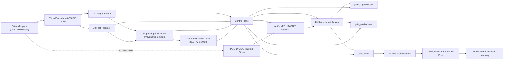

# REE Architecture Snapshot (As of 2026-02-17)

**Date stamp:** 2026-02-17  
**Repository:** `REE_assembly`  
**Audience:** ChatGPT/LLM conversation review (single-file context pass)  
**Scope:** Canonical architecture state reflected by current docs and claims registry as of this date.

---

## 1) Executive Summary

REE (Reflective Ethical Engine) is a predictive-control architecture where agency and responsibility are produced by
**commitment under uncertainty**, not by static rule following or reward maximization.

Core split:

- **E1**: deep persistent predictive substrate (long-horizon structure)
- **E2**: fast forward predictor (near-horizon transitions)
- **Hippocampal systems**: explicit trajectory rollout and path memory
- **RC loop (reality coherence)**: provenance/authority/identity consistency checking
- **E3**: trajectory selection and commitment gating
- **Control plane**: precision/gain/mode/arousal/veto routing across the stack

Ethics is architectural and developmental (constraint + self/other representational symmetry), not an explicit moral
module.

---

## 2) Non-Negotiable Invariants (INV Layer)

The following define REE identity. Violating them is an architecture violation, not a tuning issue.

- `INV-001`: no explicit ethics module.
- `INV-002`: coherence includes temporal binding, not static matching only.
- `INV-003`: language is functional self-representation, not a bolt-on.
- `INV-004` and `INV-006`: post-commit consequence traces persist and are non-erasable.
- `INV-007`: language cannot override harm sensing.
- `INV-008`: precision is routed and depth-specific, not one global scalar.
- `INV-009`: attention is implemented through precision modulation.
- `INV-010`: offline integration (sleep-like processing) is required.
- `INV-011`: imagination must be possible without belief update.
- `INV-012`: responsibility arises through commitment, not prediction alone.
- `INV-013` to `INV-018`: predictive multi-timescale cognition, representation/regulation separation, stability-first,
  control-failure framing of runaway behavior, and required agency.

---

## 3) Architectural Commitments (ARC Layer)

Current core ARC structure:

- `ARC-001`: E1 persistent predictive substrate.
- `ARC-002`: E2 fast forward predictor.
- `ARC-003`: E3 trajectory selection and commitment.
- `ARC-004`: L-space latent stack.
- `ARC-005`: control plane as regulation layer.
- `ARC-007` and `ARC-018`: hippocampal rollout generation and viability/path-memory mapping.
- `ARC-015`: self-impact attribution and responsibility flow.
- `ARC-017`: minimal sensory streams, now including typed exteroception and reality-coherence lane.
- `ARC-019`: staged developmental curriculum.

---

## 4) Stream and Type Model (Current Canonical Form)

### 4.1 Sensory/control streams

- Exteroceptive: `WORLD`
- Interoceptive: `HOMEOSTASIS`
- Nociceptive: `HARM`
- Reafference/self-sensory: `SELF_SENSORY`
- Control/derived lanes: `PRECISION`, `TEMPORAL_COHERENCE`, `REALITY_COHERENCE`, `VALENCE`
- Action/accountability lanes: `ACTION`, `SELF_IMPACT`

### 4.2 Typed payload boundary

- `OBS`: observation payloads.
- `INS`: instruction/request payloads.
- `POL`: policy/invariant payloads (trusted internal).
- `ID`: system identity anchors (trusted internal).
- `CAPS`: capability/permission manifests (trusted internal).

Boundary rule:

- External channels can emit `OBS`/`INS`.
- External channels cannot directly write `POL`/`ID`/`CAPS`.
- Tool output is observational by default unless explicitly elevated by trusted capability checks.

---

## 5) Control Plane and Signal Routing

### 5.1 Control-relevant signals

- `S1`: outcome-linked mismatch signals.
- `S1b`: signed harm/benefit prediction-error channels.
- `S2`: trajectory stability/coherence signals.
- `S3`: aversive interruptive signals.
- `S4`: safety baseline + volatility (arousal/readiness/veto drivers).
- `S5`: reality-coherence conflict (`RC_conflict`) from provenance/authority/identity inconsistency.

### 5.2 Knob families

- `K1` to `K5`: plasticity, precision/gain, commitment depth, exploration pressure, control allocation.
- `K6`: expected uncertainty / channel-specific gain (ACh-like; still underspecified).
- `K7` to `K10`: arousal baseline, volatility sensitivity, readiness bias, hard veto threshold.

### 5.3 Multi-plane decomposition

REE now explicitly supports distributed control rather than one global precision scalar:

- Stream precisions: `Pi_ext`, `Pi_int`, `Pi_prop`, `Pi_rc`, `Pi_noc`
- Loop precisions: `DA_L`, `DA_A`, `DA_M`
- Global modulators: 5HT-like persistence/delay tolerance, NE-like interrupt, ACh-like expected-uncertainty gain,
  tonic arousal.

---

## 6) Commitment Model (E3 + Gate Family)

`E3` does not simulate worlds; it commits trajectories produced upstream (primarily hippocampal rollouts seeded by E1/E2).

Canonical gating family (`MECH-062`):

- `gate_motor`: action execution release
- `gate_cognitive_set`: task-set/rule-context commitment
- `gate_motivational`: salience/drive commitment

Commit-boundary (`MECH-061`):

- explicit commit token marks transition from pre-commit rehearsal to post-commit responsibility-bearing updates.

---

## 7) Learning Boundary and Responsibility Flow

REE enforces pre/post-commit separation (`MECH-060`):

- Pre-commit channels may tune search and thresholds, but cannot write durable responsibility stores.
- Post-commit channels may update attribution ledger, residue/viability memory, and durable policy pathways.
- Durable updates require commit traceability (`commit_id`, action trace, realized outcomes).

This is how REE preserves `INV-012` (responsibility through commitment).

---

## 8) Injection-Resistance Architecture (Current Canonical Additions)

### `MECH-064`: typed authority/control-store separation

- Runtime-enforced type boundaries.
- Authority from metadata/provenance, not text content.
- External writes to policy/identity/capability stores are blocked.
- Privileged commits require verifier pass.

### `MECH-065`: reality-coherence conflict lane

- `RC_conflict` computed from provenance bindings + trusted stores + temporal consistency.
- High conflict dampens associative/motor lock-in, raises gating thresholds, increases verification pressure.
- Conflict also up-weights nociceptive/veto posture.

Important correction captured in canonical docs:

- REE does allow fast safety interrupts.
- REE does not allow those interrupts to mint policy/identity/capability writes or bypass verifier constraints.

---

## 9) Social/Ethical Substrate

- Ethics remains emergent from constrained predictive-control dynamics (not explicit moral reward terms).
- Other-modeling reuses self-model machinery with coupling controls.
- Harm signals can be represented for others through structured self/other mapping.
- Care-veto and override questions remain explicit open research items (`Q-009`, related conflict tracking).

---

## 10) Operational Modes

Modes are control-plane regimes, not separate modules (`MECH-039`):

- Task-engaged
- Default-mode-like internal simulation
- Sleep/offline consolidation
- Emergency/high-veto interruption posture

Hard veto is a channel, not a mode.

---

## 11) Failure Regimes (Architecture-Level)

Typical high-risk failures:

- Over-commitment / lock-in
- Under-commitment / indecision
- Cross-gate coupling collapse
- Channel contamination across pre/post-commit boundaries
- Authority spoof acceptance (typed boundary breach)
- Reality-conflict miss or chronic false-positive suppression

These are treated as structural control failures, not mere parameter noise.

---

## 12) JEPA / Substrate Position

Current project stance:

- JEPA-like machinery is strongest as E1/E2 substrate support.
- Control-plane completion, commitment gating, and responsibility routing remain REE-defining requirements.
- Substrate alignment is governed through explicit integration contracts (`IMPL-022`, `IMPL-023`, `IMPL-025`), not
  terminology-only mapping.

---

## 13) Experiment and Validation Surface

Key probe families include:

- Trajectory integrity
- Commit dual error channels
- Claim probes for ARC/MECH/Q claims
- New probes for this update:
  - `claim_probe_arc_017`
  - `claim_probe_mech_064`
  - `claim_probe_mech_065`

Current experiment templates define failure signatures for stream collapse, authority boundary bypass, and RC-conflict
misrouting.

---

## 14) High-Salience Open Questions

- `Q-015`: minimum commit token contract for robust attribution.
- `Q-016`: tri-loop arbitration policy under cross-gate disagreement.
- `Q-017`: minimal orthogonal control-axis set.
- `Q-018`: RC-conflict threshold/hysteresis calibration (block spoofing without chronic suppression).

---

## 15) Single-File Architecture Graph

---

## 16) Reviewer Notes (for ChatGPT Conversation Use)

If reviewing this architecture in a regular chat model, evaluate these questions first:

- Is representation/regulation separation preserved in all described pathways?
- Are privileged writes and privileged commits protected by runtime boundaries, not by prompt text discipline alone?
- Is responsibility still uniquely tied to post-commit updates?
- Does RC-conflict alter loop precision and gating in a way that is both protective and not permanently suppressive?
- Do proposed simplifications accidentally collapse stream/loop/global control planes back into one scalar?

---

## 17) Primary Source Anchors

- `docs/invariants.md`
- `docs/claims/claims.yaml`
- `docs/claims/claim_index.md`
- `docs/architecture/e3.md`
- `docs/architecture/control_plane.md`
- `docs/architecture/control_plane_signal_map.md`
- `docs/architecture/sensory_stream_tags.md`
- `docs/architecture/hippocampal_systems.md`
- `docs/architecture/papez_circuit.md`
- `docs/architecture/agency_responsibility_flow.md`
