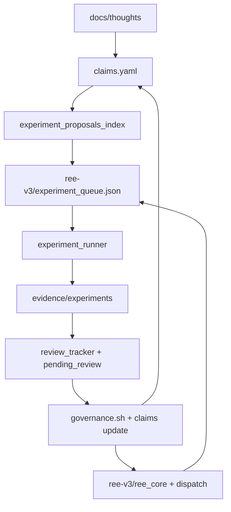

# How REE Develops

**One sentence:** REE develops by converting claims into experiments, experiments into evidence, evidence into governance decisions, and decisions back into architecture and implementation.

---

## Not a normal codebase

REE is not being developed as a conventional application where features ship when tests pass. It is being developed as a **claim-governed experimental system**: every architectural commitment is registered, stress-tested, reviewed, and allowed to strengthen or weaken the epistemic ledger. Governance prevents silent collapse -- when evidence contradicts a claim, the registry must say so.

---

## The closed epistemic loop



**ASCII (terminals / plain text):**

```
IDEA / THOUGHT
    -> docs/thoughts/
    -> extraction
docs/claims/claims.yaml
    -> governance / planning
evidence/planning/experiment_proposals_index.v1.json
    -> queue
ree-v3/experiment_queue.json
    -> runner
REE_assembly/evidence/experiments/
    -> review
review_tracker.json + pending_review.md
    -> governance
claims confidence / roadmap / implementation dispatch
```

**Step-by-step:**

| Step | What happens | Where to look |
|------|----------------|---------------|
| 1 | Raw ideas and audits land as thoughts | `docs/thoughts/` |
| 2 | Extracted commitments become registered claims | `docs/claims/claims.yaml` |
| 3 | Backlog proposes experiments against claims | `evidence/planning/experiment_proposals_index.v1.json` |
| 4 | Approved work is dispatched to the runner | `ree-v3/experiment_queue.json` |
| 5 | Runs produce manifests and metrics | `evidence/experiments/` |
| 6 | Humans/agents confirm review; inbox lists gaps | `review_tracker.json`, `pending_review.md` |
| 7 | Governance updates confidence, holds, promotions | `bash scripts/governance.sh`, `claims.yaml` |
| 8 | Accepted substrate changes land in code | `ree-v3/ree_core/`, plan docs under `evidence/planning/` |

External frameworks enter through **REE_convergence** (intake packets, human adjudication, promotion) -- see [DEVELOPMENT.md](../DEVELOPMENT.md#knowledge-intake-and-promotion-flow).

---

## Repositories

| Repository | Role | Branch |
|------------|------|--------|
| **REE_assembly** | Canonical theory, claims, governance, experiment evidence | `master` |
| **ree-v3** | Active experimental substrate (PyTorch implementation + queue) | `main` |
| **REE_Working** | Local umbrella: agent orchestration, `TASK_CLAIMS`, session state | (umbrella) |
| **REE_convergence** | External intake, translation, promotion packets | `master` |
| **ree-v2** | V2 substrate (closed; historical lane) | `main` |
| **ree-v1-minimal** | Baseline / parity harness | `main` |
| **ree-experiments-lab** | Archived -- do not use | `main` |

All active repos live under **`/Users/dgolden/REE_Working/`** only. Do not use the old iCloud path under `~/Documents/GitHub/REE_Working/`.

---

## Key files (newcomer map)

| Path | Public label | When to open |
|------|----------------|--------------|
| `docs/claims/claims.yaml` | Epistemic ledger | Register or update a claim; check status, confidence, holds |
| `docs/roadmap.md` | Program roadmap | Current phase, immediate queue, bottlenecks |
| `evidence/planning/experiment_proposals_index.v1.json` | Experiment backlog index | Choose what to run next (lightweight; do not read full proposals JSON) |
| `ree-v3/experiment_queue.json` | Experiment dispatch queue | See what is queued or claimed; append only via `/queue-experiment` |
| `ree-v3/runner_status.json` | Runner completion memory | Avoid reusing EXQ IDs; see recent outcomes |
| `evidence/experiments/` (manifests) | Result packs | Inspect PASS/FAIL/ERROR for a run |
| `evidence/experiments/pending_review.md` | Evidence inbox | Unreviewed results -- clear before new science |
| `evidence/experiments/review_tracker.json` | Review memory | Sole source of "discussed" / reviewed state |
| `REE_Working/TASK_CLAIMS.json` | Concurrency lock | Before editing shared files across sessions |
| `REE_Working/WORKSPACE_STATE.md` | Session log | Recent work; check before high-contention edits |
| `evidence/planning/substrate_queue.json` | Substrate readiness queue | Implementation gaps blocking experiments |
| `evidence/experiments/runner_heartbeats/` | Live runner telemetry | Multi-machine freshness (with `/machines` dashboard) |
| `REE_assembly/explorer.html` (via serve.py) | Live governance cockpit | Navigate claims, governance, experiments visually |

---

## Four kinds of work

| Kind | Typical tasks | Primary repo | Skills / tools |
|------|----------------|--------------|----------------|
| **1. Theory / claims** | New MECH/ARC/SD, conflicts, architecture docs | REE_assembly | `docs/README.md` prompts; manual `claims.yaml` edits under governance discipline |
| **2. Implementation / substrate** | `ree_core` changes, substrate plans, gap closure | ree-v3 + REE_assembly plans | `/implement-substrate` |
| **3. Experiment / evidence** | Scripts, queue, manifests, autopsy | ree-v3 + REE_assembly evidence | `/queue-experiment`, `/diagnose-errors`, `/failure-autopsy` |
| **4. Governance / reconciliation** | Review runs, update confidence, promotions | REE_assembly | `/governance`, Explorer Governance view |

---

## What counts as done

Work is not "done" because code merged or a run finished. Done means the epistemic loop is closed for that unit of work:

1. **Experiment finished** -- manifest in `evidence/experiments/`; queue entry removed.
2. **Experiment reviewed** -- run_id in `review_tracker.json`; dir not listed in `pending_review.md` (regenerate via `python scripts/generate_pending_review.py` from REE_assembly root).
3. **Governance applied** -- `claims.yaml` / `evidence_direction` / holds updated when the science warrants it; `bash scripts/governance.sh` run after batch review.
4. **Substrate landed** -- if implementation was required, plan-of-record doc and `substrate_queue.json` updated; validation EXQ queued or PASS recorded.
5. **Session hygiene** -- `TASK_CLAIMS` entry set to `done`; one line in `WORKSPACE_STATE.md` Recent Work.

Superseded buggy runs: use lettered EXQ IDs, `supersedes` in queue/manifest, and `evidence_direction: superseded` on invalidated evidence (see `REE_Working/CLAUDE.md` EXQ versioning policy).

---

## Start here (Explorer-first)

The fastest way to see the whole system is the Explorer, not a tour of folders.

1. From `REE_assembly` repo root:
   ```bash
   caffeinate -i python3 serve.py
   ```
2. Open **http://localhost:8000/explorer**
3. **Docs** view -> **Start here** -> this document and `roadmap.md`
4. **Governance** view -> decision inbox, conflicts, pending recommendations
5. Check **pending review** (also listed in Governance / `pending_review.md`)
6. **List** or **Graph** view -> inspect claims; use Triple View for architecture alignment
7. **Experiments** view -> queue depth, runner status, machines
8. Only then edit `ree-v3` or queue files (via skills)

Related dashboards: **Closure** (`/closure`) for plan-of-record gaps; **Machines** (`/machines`) for multi-host runners; **Brain map** (`/brain-map`) for region overlays.

---

## Vocabulary (public labels)

| Existing thing | Public-facing label |
|----------------|---------------------|
| REE_assembly | Canonical theory and governance layer |
| ree-v3 | Active experimental substrate |
| REE_Working | Local orchestration workspace |
| `claims.yaml` | Epistemic ledger |
| `experiment_queue.json` | Experiment dispatch queue |
| `pending_review.md` | Evidence inbox |
| `review_tracker.json` | Review memory |
| `TASK_CLAIMS.json` | Concurrency lock / active session claims |
| Explorer | Live governance cockpit |
| `experiment_proposals_index.v1.json` | Experiment proposal index |
| `substrate_queue.json` | Substrate readiness tracker |
| EXQ / V3-EXQ-* | Experiment queue IDs (not script filenames) |

---

## Common failure modes

| Symptom | Likely cause | What to do |
|---------|----------------|------------|
| Results exist but governance ignores them | Not in `review_tracker.json` | Review run; update tracker; rerun `generate_pending_review.py` |
| `pending_review.md` never clears | Discussed status inferred from filesystem | Use `review_tracker.json` only; mark reviewed explicitly |
| Stale `TASK_CLAIMS` | Session ended without closing claim | Confirm with owner; prune done entries >24h |
| ERROR or wrong science after "fix" | Reused EXQ ID or wrong `claim_ids` | New letter suffix; `/diagnose-errors` or `/queue-experiment` |
| Substrate-readiness FAIL | Code path not wired | `/implement-substrate`; check `substrate_queue.json` |
| Duplicate runs on two machines | Queue claim race without `--auto-sync` | Use runner claiming; check `runner_heartbeats/` |
| Silent loss of evidence edits | Heartbeat `git pull --autostash` without claim on `evidence/` | Open `TASK_CLAIMS` covering `evidence/` before editing; commit or release |
| Confidence drift without review | Manual manifest edits skipped governance | Run `/governance`; do not hand-edit confidence without adjudication |

Agents: read [NEW_AGENT_START_HERE.md](../../NEW_AGENT_START_HERE.md) at the umbrella root before touching shared files.

---

## Where detail lives

- **Philosophy and architecture stakes:** [README.md](../README.md)
- **Contributor setup, weekly cadence, intake flow:** [DEVELOPMENT.md](../DEVELOPMENT.md)
- **Current phase and immediate queue:** [roadmap.md](roadmap.md)
- **Agent operating procedure (verbatim prompts):** [docs/README.md](README.md)
- **Umbrella session rules:** [REE_Working/CLAUDE.md](../../CLAUDE.md)
- **Skills:** `.claude/skills/` and `.agents/skills/` under REE_Working (e.g. `queue-experiment`, `governance`, `failure-autopsy`)
