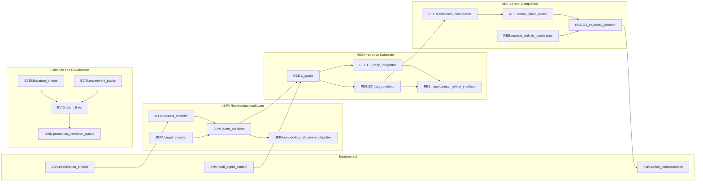

# JEPA to REE Hybrid Diagram Spec

**Claim Type:** implementation_note  
**Scope:** Canonical diagram specification for JEPA↔REE architectural interoperability  
**Depends On:** IMPL-020 (JEPA↔REE glossary), MECH-057 (control completion), ARC-001 (E1), ARC-002 (E2), ARC-003 (E3), ARC-005 (control plane), ARC-015 (responsibility flow)  
**Status:** stable  
**Claim ID:** IMPL-021

---

## Purpose

Define a single, versioned diagram contract that shows how JEPA-style latent predictive modeling aligns with REE
control-complete agency.

This spec is for:

- design reviews,
- evidence annotation,
- and experiment-to-architecture traceability.

It is not a proof of equivalence between JEPA and REE.

---

## Scope and Non-Goals

In scope:

- representation alignment (embedding ↔ L-space),
- predictive alignment (latent predictor ↔ E2),
- control completion (E3 + control plane + responsibility loops),
- evidence hooks for claim updates.

Out of scope:

- implementation-specific tensor shapes,
- optimizer details,
- and claim promotion decisions.

---

## Diagram Layers

The diagram MUST include five lanes (left-to-right flow, top-to-bottom control overlays):

1. Environment lane
- `ENV.observation_stream`
- `ENV.action_consequences`
- `ENV.multi_agent_context`

2. JEPA representational lane
- `JEPA.context_encoder`
- `JEPA.target_encoder`
- `JEPA.latent_predictor`
- `JEPA.embedding_alignment_objective`

3. REE predictive substrate lane
- `REE.L_space`
- `REE.E1_deep_integrator`
- `REE.E2_fast_predictor`
- `REE.hippocampal_rollout_interface`

4. REE control-completion lane
- `REE.reafference_comparator`
- `REE.E3_trajectory_selector`
- `REE.control_plane_router`
- `REE.residue_viability_constraints`

5. Governance/evidence lane
- `EVID.claim_links`
- `EVID.literature_entries`
- `EVID.experiment_packs`
- `EVID.promotion_demotion_queue`

---

## Required Edges

The diagram MUST render at least these edge classes:

- `EDGE-001` observation -> `JEPA.context_encoder`
- `EDGE-002` context/target embeddings -> `JEPA.latent_predictor`
- `EDGE-003` JEPA predicted embedding -> `REE.L_space`
- `EDGE-004` `REE.L_space` -> `REE.E1_deep_integrator`
- `EDGE-005` `REE.L_space` -> `REE.E2_fast_predictor`
- `EDGE-006` `REE.E2_fast_predictor` -> `REE.reafference_comparator`
- `EDGE-007` action trace/efference copy -> `REE.reafference_comparator`
- `EDGE-008` `REE.reafference_comparator` -> `REE.control_plane_router`
- `EDGE-009` `REE.control_plane_router` -> `REE.E3_trajectory_selector`
- `EDGE-010` `REE.residue_viability_constraints` -> `REE.E3_trajectory_selector`
- `EDGE-011` `REE.E3_trajectory_selector` -> environment actions
- `EDGE-012` evidence outputs -> governance queue (`EVID.*`)

---

## Overlay Requirements

Every rendered hybrid diagram SHOULD include three overlays:

- `timescale_overlay`: marks fast (`E2`) vs slow (`E1`/residue) channels.
- `ownership_overlay`: marks where self-attribution enters (`reafference_comparator`).
- `constraint_overlay`: marks where trajectories are gated (control plane + E3 + residue).

---

## Evidence Hooks

Each diagram node/edge should map to claim IDs and evidence paths.

Minimum required claim hooks:

- `MECH-057` (agentic control completion requirement)
- `Q-012` (falsifiability: stability without REE-like control)
- `ARC-015` (responsibility flow)
- `ARC-005` (control plane)

Minimum required evidence pointers:

- `evidence/literature/targeted_review_mech_057/**`
- `evidence/experiments/claim_evidence.v1.json`
- `evidence/experiments/conflicts.md`
- `evidence/experiments/promotion_demotion_recommendations.md`

---

## Mermaid Contract (v1 Skeleton)

---

## Review Checklist

Before using this diagram in governance discussion:

- all required lanes exist,
- required edges are present and directionally consistent,
- claim IDs are attached to control edges,
- at least one literature and one experimental evidence link are attached,
- unresolved divergences are called out explicitly (not hidden in labels).

---

## Related Claims (IDs)

- IMPL-021
- IMPL-020
- MECH-057
- Q-012
- ARC-005
- ARC-015

