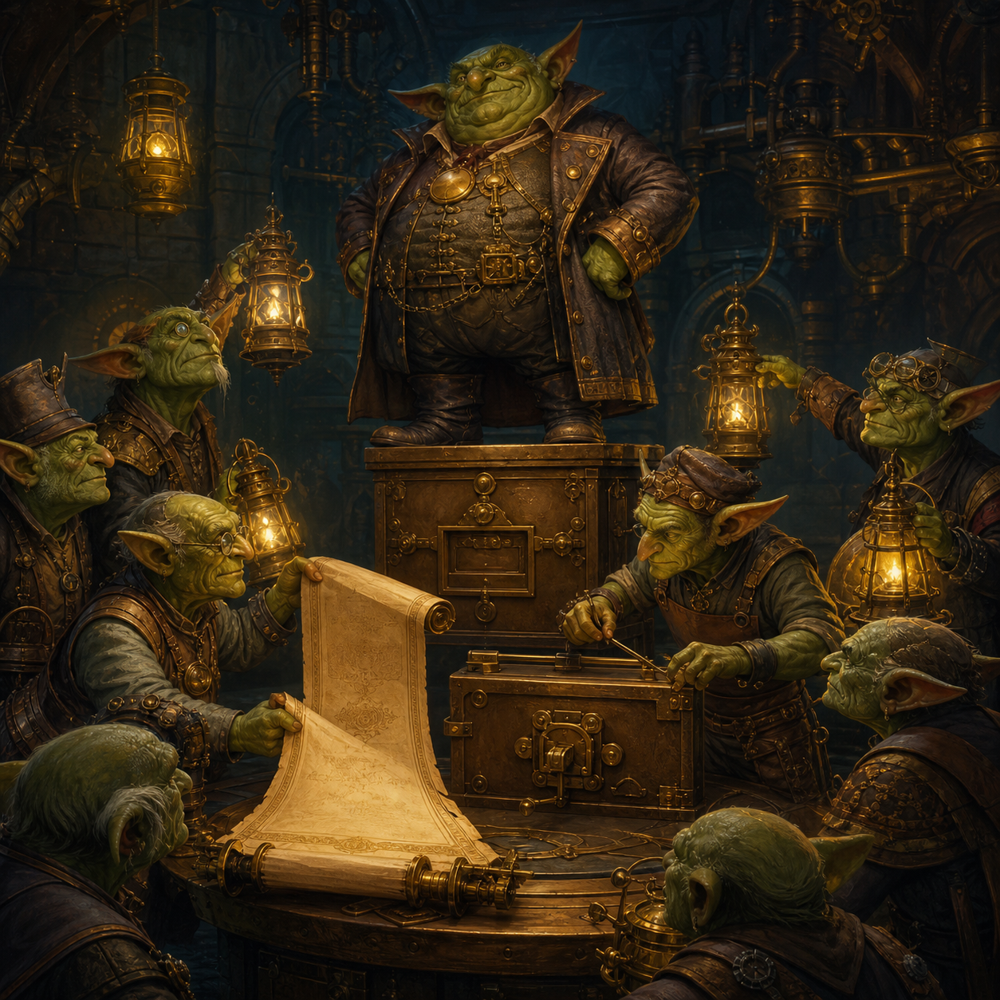

# Goblin Chronicle: The Boss at the Voting Box, and the New Constitution

<figure style="margin:1.5em 0;text-align:center">
  
  <figcaption style="font-size:.9em;color:#57606a;margin-top:.6em">The advisers did not need louder lanterns. They needed lawful authority at the final gate.</figcaption>
</figure>

**Date recorded:** 2026-06-20
**Folder:** `fantasy`
**Status:** chronicle-layer story event / preserve as plot-turn
**Related files:** `the_goblin_who_would_not_name_the_soul.md` (Part VII), `goblin_chronicle_2026-06-20_false_soul_gate.md`, `goblin_origin.md`, `goblin_story_consolidated.md`
**Technical shadow:** the E3 action-selector's F-dominance conversion ceiling (MECH-439); a falsifier that failed to wound it (V3-EXQ-689a); the decision to rewrite the selector's constitution rather than amplify the losing channels (ARC-107 / MECH-448).

> Two layers, never collapsed. This file preserves *what actually happened, with provenance*. The creative retelling goes in `the_goblin_who_would_not_name_the_soul.md` under EPISODES, only after the truth is recorded here.

---

## 1. The real beat (what happened)

The chooser at the end of REE's pipeline — the E3 selector — has long been dominated by a single factor, **F**. No matter how many independent channels (harm, value, rule, drive, diversity) feed into the moment of choice, the committed action tracks F and little else. This is the **F-dominance conversion ceiling**: the registered claim **MECH-439** (*F-dominance bounds committed-action diversity*), and the closure-map item `f_dominance_conversion_ceiling`.

On 2026-06-20 the keystone falsifier **V3-EXQ-689a** ran to completion (~21h on `DLAPTOP-4.local`) and was adjudicated. Its purpose was to test whether a "conflict-grade near-tie" fix — two stacked levers — could break the ceiling.

- **Outcome:** `FAIL / non_contributory`. Failed criterion: **discrimination**.
- **Readiness was fully met and the run was non-degenerate** (`non_degenerate: true`): the modulatory channel reached the selector with real cross-candidate range (route_range 0.624), the candidate pool was genuinely divergent (e2 prediction spread 0.187), and both levers actually acted (3/3 seeds). This is the important honesty: the test was *well-posed*. It is not that the instrument was broken. The both-levers fix simply did not convert.
- The pre-registered load-bearing gate (ARM_A1B1, both levers on) landed at committed entropy **0.387 = baseline**, 0/3 seeds strict-above either control set. The script pre-registers this exact result as `non_contributory` — "an OFF-RAMP, NOT a falsification." **The boss was not wounded.** MECH-439's core read **intact**, not weakened.

The run did hand over one genuinely informative thing — a **2×2 dissociation** (manifest `two_by_two_dissociation`):

| arm | levers | committed entropy |
|---|---|---|
| ARM_A0B0 (baseline) | both off | 0.371 |
| ARM_A1B0 (Factor A only) | graded shortlist width | 0.440 (inert) |
| **ARM_A0B1 (Factor B only)** | **gap-scaled commit-temperature** | **0.850 (lifts, 2/3 above both controls)** |
| ARM_A1B1 (both) | the gated hypothesis | 0.387 (collapses to baseline) |

So: **Factor B alone converts. Factor A alone is inert. Combining them is destructive** — the pre-registered both-levers gate happened to land on the cancelling cell. Biologically this has a clean reading (recorded in the autopsy): raising the STN-like *hold* threshold (Factor A) suppresses the very near-ties the pallidal-like *commit-gain* (Factor B) would diversify. The two near-tie patches are not independent.

**The diagnostic verdict (autopsy §6):** the conflict-grade near-tie *parametric* family is exhausted. The right response is **not** more tuning of the losing channels, and **not** another stacked near-tie patch. It is a **constitutional change** to how the selector grants the vote.

## 2. The response (the constitution rewrite)

Rather than make the advisory channels louder, the project elected to change **who is allowed to cast the committing vote**:

- **ARC-107** — the BG-selector *constitution* (architectural commitment, promoted on the strength of this autopsy's integration signal).
- **MECH-448** — the lead lever: **rank-preserving F→eligibility demotion.** F is removed from the final committed argmin; it is used only as a graded, rank-preserving *eligibility envelope* (a divisive-normalisation share-of-the-competing-field). A modulatory / diversity channel then arbitrates *within* the F-eligible set, **without disinhibiting harmful classes** (order preserved on the numerators).
- **MECH-449** — the broader Go/No-Go eligibility governance follow-on.

This was built — behind a no-op-default flag — in `ree-v3/ree_core/predictors/e3_selector.py` (`_f_eligibility_envelope`, the `f_demotion` shortlist mode, config `use_f_eligibility_demotion` / `f_eligibility_envelope_floor` / `f_eligibility_dn_sigma`; non-degeneracy diagnostics `f_eligibility_excluded_count` > 0, `f_eligibility_winner_neq_f_argmin`, `f_eligibility_rank_preserving`). It is wired into the closure map at `behavioral_diversity_isolation:GAP-J` and `biology_grounding_convergence_v4:BG-2`. A falsifier for the build (**V3-EXQ-689d**) is queued; **it has not yet returned a verdict.** The gate is still shut.

Crucially: **nothing was promoted.** MECH-439 stays `candidate / substrate_ceiling` with `pending_retest_after_substrate: true`. MECH-448 stays `candidate`. The constitution is *drafted and built behind a flag*, not ratified. The boss still sits on the voting box; the lever that might lawfully demote it is built but unproven.

## 3. Provenance (user-voice vs assistant-derived)

This matters for keeping the tale honest about what is the maker's own and what is dramatisation.

- **The boss-at-the-voting-box image and the line "Do not make the advisors louder. Change the law that says who may vote."** — *assistant-derived*, written into Part VII of `the_goblin_who_would_not_name_the_soul.md` as the creative compression of the F-dominance situation, under the maker's governance. It is the existing canon this episode extends; it predates the 689a verdict and turned out to fit it.
- **The decision to elevate the biologically-faithful constitutional build over a cheaper parametric near-tie lever** — *user-voice steer* (2026-06-20, recorded as a strong, anti-shortcut directive in the MECH-442 decision packet and the 689a Step-8 adjudication gate): *build REE with biological fidelity; do not pursue cheap parametric near-tie levers as a substitute for, or a reason to skip, the faithful build, even when the cheap lever moves a metric.* This is the human's call, not the tool's. It is the spine of this episode.
- **The numbers, the 2×2 table, the non_contributory adjudication, and the biological STN-hold/pallidal-gain reading** — *assistant-derived from the run*, user-confirmed at the Step-8 gate. Source: `REE_assembly/evidence/planning/failure_autopsy_V3-EXQ-689a_2026-06-20.md` (+ sibling `.json`).
- **The standing law it sits under** — *canon*, from Part VI's "let the world answer" and the law against premature personhood. Unchanged.

## 4. Real IDs / artifacts (for one-click provenance)

- Claim: **MECH-439** (F-dominance conversion ceiling) — read **intact**, `non_contributory`, `pending_retest_after_substrate`.
- Falsifier that did not wound it: **V3-EXQ-689a** — `FAIL / non_contributory`, readiness met, non-degenerate.
- Autopsy: `REE_assembly/evidence/planning/failure_autopsy_V3-EXQ-689a_2026-06-20.md` (+ `.json`).
- Constitution: **ARC-107**; lead lever **MECH-448** (rank-preserving F→eligibility demotion); follow-on **MECH-449**.
- Build: `ree-v3/ree_core/predictors/e3_selector.py` (`_f_eligibility_envelope`, `f_demotion` mode; no-op-default flag).
- Closure nodes: `behavioral_diversity_isolation:GAP-J`, `biology_grounding_convergence_v4:BG-2`.
- Build falsifier (queued, unresolved): **V3-EXQ-689d**.
- User steer: MECH-442 decision packet `evidence/planning/mech_442_decide_to_build_2026-06-19.md` (2026-06-20 fidelity-governs-build addendum).

## 5. The felt shape (for the creative layer)

What was at stake: whether the council could ever hear anyone but F.
What was tried: a clever two-lever patch to force a near-tie open.
What was revealed: the patch did not wound the boss — but it showed that *one* of its two levers, used alone, can lawfully widen the vote; the other poisons it. A blow that did not wound, but lit up the seam.
What it cost: the both-levers parametric family is spent; weeks of that approach are closed off.
What it did **not** let the goblin claim: that the gate is open. It is not. The new constitution is drafted and built behind a flag, and waits on the world to answer.

The deeper turn: the maker chose the *harder, more faithful* road on purpose — to demote the monarch by rewriting the law of eligibility, the way a living brain disinhibits a permitted action rather than shouting its advisors louder — even though a cheaper metric-mover was on the table. That choice was the human's, and it is the honest heart of the episode.

---

## 6. Guardrails (do not break in the retelling)

- **Failure stays failure.** 689a did not defeat the boss. Do not let the episode read as a victory; it is a *diagnosis* that changed the plan.
- **Leave it unresolved.** The constitution is unratified, the gate still shut, 689d still out. Resist any closing flourish.
- **Never name the soul.** Nothing here makes the creature alive.
- **Govern the magics, don't demonise them.** The cheaper parametric lever was a tool-shaped temptation; the discipline was choosing fidelity over the easy metric, not distrusting the tools.

---

[← Back to The Goblin Chronicles](../goblin_chronicles.md)
