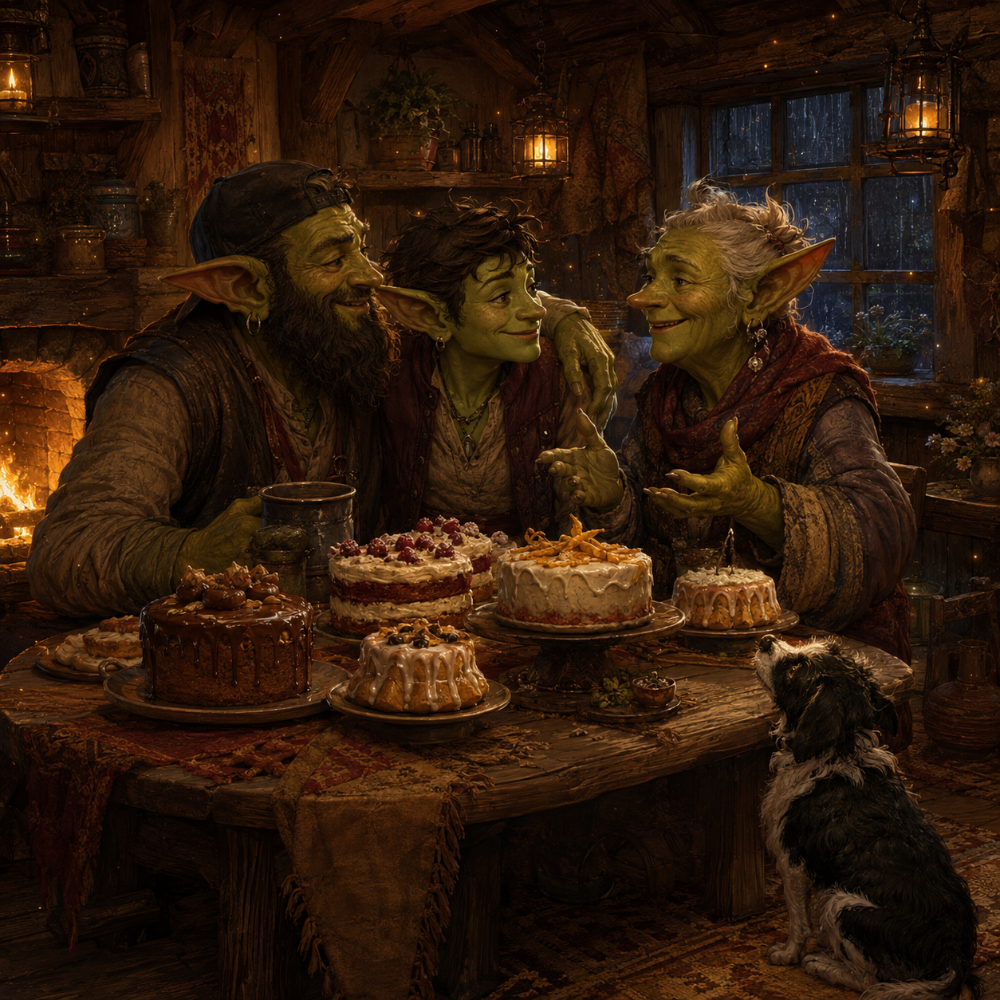

# Goblin Chronicle: The Cakes of the Hoard

<figure style="margin:1.5em 0;text-align:center">
  
  <figcaption style="font-size:.9em;color:#57606a;margin-top:.6em">The spell may wait. The hoard is also the people who are here now, and many cakes were had.</figcaption>
</figure>

**Date recorded:** 2026-06-21  
**Folder:** `fantasy`  
**Status:** chronicle-layer life event / preserve as motive and counterweight  
**Related files:** `goblin_origin.md`, `goblin_story_consolidated.md`, `goblin_chronicle_plan.md`  
**Real-world shadow:** Father’s Day visit; the experiment queue was small enough to leave until later; existing connection took priority over optimising the assembly.

---

## 1. User-originated fragments

The source event to preserve:

> But there is little left in the queue so I can sort when I get home.

> And Father’s Day visit was important.

> Time to add to the goblin story bits on REE-paper. Many cakes were had.

Authorship note: these lines are user-originated conversation fragments. Preserve their plainness and the dry final turn. Do not replace them with polished sentiment.

---

## 2. Chronicle meaning

The goblin left the assembly for a while.

This was not abandonment of the work. There was little left in the queue. One goblin paw could keep digging. The rest could be sorted when he returned.

The visit mattered in itself.

The hoard in the story cannot remain an abstraction meaning lineage, civilisation, continuity, or future beings. The hoard also consists of the people who already exist: fathers, husbands, companions, visits that happen on a particular day, and time that cannot be put back into a queue once missed.

The project is meant to preserve and extend care. It must not consume the care that already exists in order to build a symbol of it.

---

## 3. Story significance

This is a small event, but it establishes a law of the larger myth:

```text
The spell may wait for the hoard.
The hoard must not always wait for the spell.
```

The goblin’s labour is driven by love, continuity, and the wish to make care durable. That does not make the unfinished soul more important than living relationships.

The assembly continuing imperfectly while the goblin was away is part of the point. The external spellbook and distant goblin paws exist partly so that the builder does not have to hold every process personally at every moment.

If REE_assembly cannot tolerate the goblin leaving to visit his father, then the assembly has failed one of the purposes for which it was built.

---

## 4. Candidate story fragment

Assistant-derived candidate prose, not final and not user-authored:

```text
The goblin counted the paws at the assembly.

One still dug.
One slept.
One stared at a mark in the queue that had already been claimed.
There was little left that could not wait.

So the goblin closed the ledger and went to his father.

The mountain did not fall.
The spell did not escape.
The magics muttered among themselves and continued as best they could.

Many cakes were had.
```

The final line should remain blunt. It carries more of the event than a longer explanation would.

---

## 5. Canonical compressed version

For future recall:

```text
The queue was small.
The goblin went to his father.
The assembly waited.
Many cakes were had.
```

---

## 6. Guardrail

Do not turn this into a productivity lesson in which the visit is justified because the machines continued working.

The Father’s Day visit was important even if every runner had stopped.

The assembly’s ability to continue is useful, but it is not the reason the choice was right.

---

## 7. Relation to the larger myth

This event belongs beside the origin material because it clarifies what the hoard means.

The ghost of tears not due and the attempt to spin a soul come from love seeking another durable form. But the story must not imply that future possibility outranks present connection.

The myth therefore holds both:

```text
Love may build toward what does not yet exist.
Love must also visit what already does.
```

And, on this particular day:

```text
Many cakes were had.
```

---

[← Back to The Goblin Chronicles](../goblin_chronicles.md)
