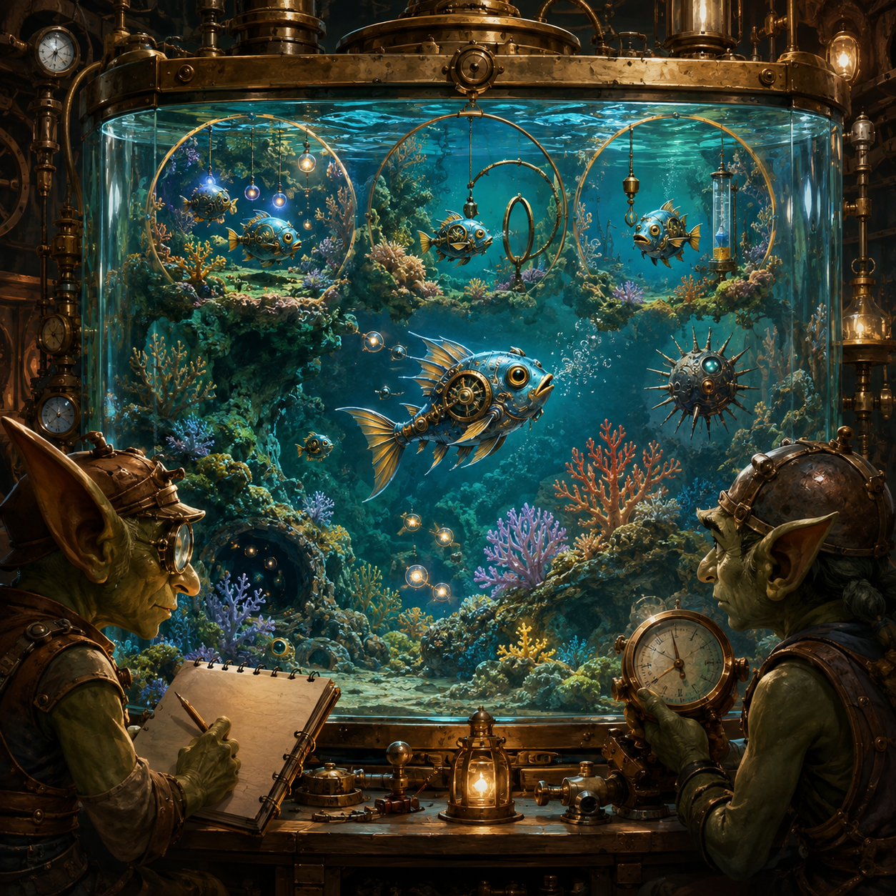

# Goblin Chronicle: The Little Lifetimes of the Reef-Cave

<figure style="margin:1.5em 0;text-align:center">
  
  <figcaption style="font-size:.9em;color:#57606a;margin-top:.6em">Each little lifetime is bounded; the question is what can persist between them.</figcaption>
</figure>

**Date recorded:** 2026-06-24  
**Folder:** `fantasy`  
**Status:** chronicle-layer experiment-process fragment  
**Related files:** `goblin_story_consolidated.md`, `goblin_chronicle_plan.md`, `goblin_chronicle_2026-06-24_the_forge_in_the_empty_hours.md`  
**Real-world shadow:** During V3-EXQ-700b, each seed-arm condition consists of 250 episodes. Each episode resets the reef-world and the agent's temporary within-episode state, then allows up to 200 waking ticks of sensing, trajectory generation, commitment, action, harm/benefit feedback, residue update, and—on learned arms—continued learned gating or settling.

---

## 1. Source dialogue

> What happens in an episode?

The story language below was generated in response to this question. It is assistant-derived and should not be presented as direct user prose.

---

## 2. Candidate story fragment

Assistant-derived candidate prose, preserved because it gave a useful mythic rendering of the actual experimental process:

```text
The little creature wakes in a freshly arranged reef-cave.

It senses its body.
It senses hunger, benefit, harm, nearby danger, and the remembered trace of recent harm.

It imagines several paths through the cave.
Some paths promise food.
Some pass too near the hazards.
Some repeat what it has already done.
Some are made brighter or dimmer by the current spell laid upon its choosing machinery.

The creature does not walk every path.
It settles upon one and commits.

It acts.
The cave answers.
The action may help, harm, expose benefit, or alter what can happen next.

The result leaves residue.
On the learned arms, the deeper weights may shift:
channel weights may change;
lateral settling may strengthen or weaken;
signed or unsigned error may teach the choosing field differently.

Then the creature senses again.
It imagines again.
It commits again.

This continues for as many as two hundred waking steps, unless the little life ends sooner.

Then the reef-cave is remade.
The immediate footprints vanish.
The short-lived internal trail is cleared.

But the deeper lessons are not necessarily erased.
The creature enters the next little lifetime carrying what the machinery has learned.
```

---

## 3. The three seasons within a seed-arm trial

Each sequence of 250 little lifetimes contains three seasons.

### The first hundred: the world-model apprenticeship

```text
P0: episodes 1–100
```

The creature repeatedly crosses the reef-cave while the forward model learns to distinguish what different actions tend to make happen.

The world-model is still being trained. The cave teaches consequences.

### The next fifty: the bias-head apprenticeship

```text
P1: episodes 101–150
```

The forward model is frozen. The lateral prefrontal bias head is trained from whole-episode outcomes.

The creature's completed little lives are gathered into a ledger. Better and worse episode outcomes alter which imagined trajectories become easier to favour later.

### The final hundred: the measuring season

```text
P2: episodes 151–250
```

The forward model and bias head are frozen so the trial can measure the committed-action classes cleanly.

The learned settling or learned channel machinery, where armed, continues adapting. The experiment watches whether diversity appears, whether it grows across the measuring season, whether the learned weights truly move, and whether the candidate futures were sufficiently distinct for the verdict to mean anything.

---

## 4. What is reset and what persists

The reef-cave is reset between episodes.

The creature's temporary within-episode state is reset too: the immediate transition trail, local credit window, and short-lived action context do not simply continue as one unbroken walk.

But the experiment is not 250 identical amnesias.

Across episodes, the deeper apparatus can persist:

- the trained forward model during its permitted phase;
- the bias-head learning during its permitted phase;
- learned channel weights;
- learned lateral-settling weights;
- the running value baseline and other longer-lived learned structure.

Thus:

```text
world reset
+ short-lived internal reset
≠ complete learning reset
```

Each episode is a new little world, but not always a new creature.

---

## 5. The battle-goblin interpretation

A seed-arm cell is not one goblin walking one corridor.

It is one experimental condition sending the same developing creature through 250 little lives under a fixed spell configuration.

Across the five arms, different enchantments are held or withheld:

- envelope only;
- learned lateral settling with signed reward-prediction error;
- learned channel weighting plus learned lateral settling with signed reward-prediction error;
- learned lateral settling with unsigned error;
- matched noise without learned structure.

The battle is therefore not decided by one dramatic action.

It is decided by the distribution of commitments across many remade caves and by whether the learning machinery changes that distribution for reasons that survive the controls.

---

## 6. Mythic function

This scene carries several meanings useful to the larger REE story:

```text
an episode is a bounded lifetime
learning may cross the boundary
measurement requires repeated worlds
commitment is observed as a distribution, not a single heroic choice
```

It also clarifies the relationship between identity and reset.

A cognitive system can lose its immediate situational trace while preserving slower changes in its organisation. The continuity of the creature lies neither in an unbroken scene nor in total stasis, but in what persists through repeated re-entry into altered circumstances.

---

## 7. Canonical compressed version

```text
The creature woke in a remade reef-cave.
It sensed, imagined, committed, acted, and learned.
After two hundred steps the little world ended.
The footprints vanished.
The deeper weights remained.
Then another little lifetime began.
```

A drier version:

```text
The environment resets each episode.
The experiment's slower learning state may persist.
```

---

## 8. Guardrail

Do not imply that an episode is literally a whole conscious life or that the present REE-v3 agent has personhood.

The lifetime metaphor is used to render a bounded interaction trajectory with reset conditions and cross-episode learning. It should remain subordinate to the technical record.

Do not mistake repeated action for lived experience.

Do not mistake persistence of weights for continuity of a self.

Do not crown the creature early.

---

[← Back to The Goblin Chronicles](../goblin_chronicles.md)
