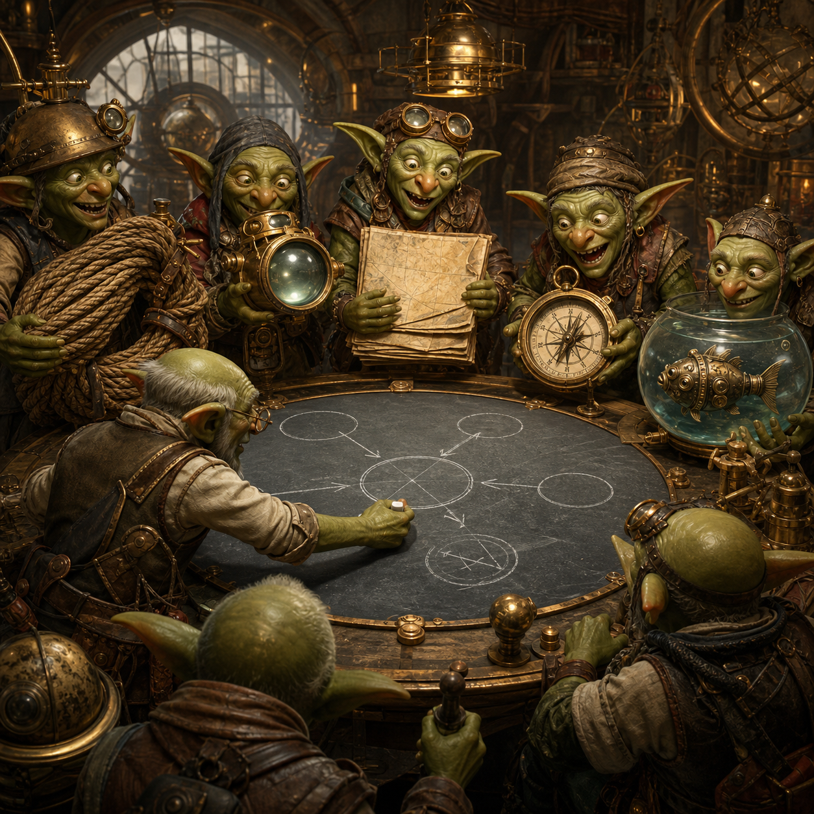

# Goblin Chronicle: The Five Expeditions

<figure style="margin:1.5em 0;text-align:center">
  
  <figcaption style="font-size:.9em;color:#57606a;margin-top:.6em">Five honest investigations returned with a narrower mystery, not a tidier story.</figcaption>
</figure>

*Placement: Immediately after The Magics Take the Long View*

## New intake

The council no longer gathered to ask whether the creature possessed a missing organ.

Those days had mostly passed.

Now they argued over muscles.

The first expedition returned carrying a very long rope.

“We counted properly this time,” they said.

The council opened the ledger.

The rope had been long enough.

The counting had been true.

Yet the mystery remained.

So the council did not celebrate.

Neither did they despair.

Instead, Ledger Goblin quietly crossed another impossible explanation from the great slate.

---

The second expedition climbed the watchtower.

“We feared the creature could not see,” they reported.

“But a smaller creature, looking through the very same window, can already find food.”

Observation Goblin folded the old accusation into a neat square and placed it in the archive.

“Then perhaps,” he said,

“the eyes are not the trouble.”

---

The third expedition returned from the reward gardens.

The fourth from the gentle valleys where children first learn to walk.

The fifth descended into the old planning vaults.

The sixth simply carried a hammer.

Refresh Goblin looked confused.

“I thought we were all solving one problem.”

Ledger Goblin smiled.

“No.”

“We have finally become clever enough to know which problem each goblin is solving.”

---

The old days had been noisy.

Every goblin cast spells at every wall.

Every strange sound summoned every engineer.

Now each expedition carried its own map.

Appetite Goblin walked toward the reward gardens.

Childhood Goblin followed the winding road through easier worlds.

Landscape Goblin searched the gentler hills.

Planner Goblin descended beneath the assembly house.

Hand Goblin carried no map at all.

Only a hammer.

“If the creature truly understands,” he muttered,

“it should be able to grip.”

---

Refresh Goblin looked disappointed.

“So no great treasure today?”

Ledger Goblin shook his head.

“No treasure.”

“Only fewer wrong roads.”

Refresh Goblin studied the map.

Yesterday it had resembled a tangled forest.

Today only a handful of paths remained.

“They still look difficult.”

“They are.”

“But now they all lead toward the same mountain.”

---

## Canonical version

The goblins stopped throwing spells at random walls.
Each expedition carried its own map.
The creature's eyes were no longer the chief suspect.
The remaining questions concerned appetite, childhood, landscape, planning, and hands.
There was little new treasure.
But many wrong roads quietly disappeared.

## Guardrail addition

Do not interpret the shrinking number of hypotheses as proof that the remaining hypothesis is correct.

The goblins celebrate narrowing uncertainty, not merely confirming their favourite story.

---

I actually like this as a companion to “The Magics Take the Long View.”

That chapter says “the project has four labours.”

This one says “the council has finally learned how to divide the labour.”

It’s a subtle shift in the mythology, but it mirrors the evolution of the actual research programme: from broad architectural uncertainty to a set of targeted, discriminative expeditions.

---

[← Back to The Goblin Chronicles](../goblin_chronicles.md)
