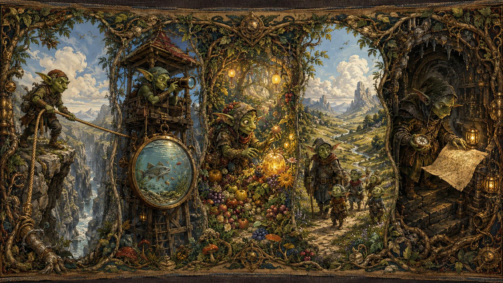

# Goblin Chronicle: The Five Expeditions

<figure style="margin:1.5em 0;text-align:center">
  
  <figcaption style="font-size:.9em;color:#57606a;margin-top:.6em">The counting was true. The mystery remained, now small enough to pursue.</figcaption>
</figure>

The council no longer gathered to ask whether the creature lacked another organ.

Those days had mostly passed.

Now they argued over muscles.

The first expedition returned carrying a very long rope.

"We counted properly this time," they said.

The counting was true.
The mystery remained.

Ledger Goblin quietly crossed another impossible explanation from the great slate.

---

The second expedition climbed the watchtower.

"We feared the creature could not see," they reported.

"But a smaller creature, looking through the very same window, can already find food."

Observation Goblin folded the old accusation into the archive.

"Then perhaps the eyes are not the trouble."

---

Soon there were five maps upon the council table.

Appetite Goblin walked toward the reward gardens.

Childhood Goblin took the winding road through easier worlds.

Landscape Goblin searched the gentler hills.

Planner Goblin descended beneath the assembly house.

Hand Goblin carried only a hammer.

<figure style="margin:1.5em 0;text-align:center">
  
  <figcaption style="font-size:.9em;color:#57606a;margin-top:.6em">Do not follow goblins. Follow questions, each to the place where it can be answered.</figcaption>
</figure>

Refresh Goblin looked worried.

"There are too many goblins."

Ledger Goblin shook his head.

"Do not follow goblins. Follow questions."

---

Weeks later Refresh Goblin returned again, expecting another spell.

Instead Ledger Goblin handed him an eraser.

"Sometimes," he said, "the bravest magic is removing words written too confidently."

The council erased labels that no longer fitted the organs.
They repaired measuring rods.
They replaced bent rulers.
They celebrated not new spells, but straighter measurements.

---

One evening Refresh Goblin sighed.

"We are late."

"Yes," said Ledger Goblin.

"Does that trouble you?"

"Only if we are late because we are lost."

He held a brass square against the newest beam.

"We are late because we keep discovering which rulers are bent."

Refresh Goblin frowned.

"Could we not ignore that?"

Ledger Goblin looked genuinely horrified.

"For a garden shed, perhaps."

He looked up toward the unfinished vault.

"We are trying to build a cathedral."

---

## Canonical

The goblins stopped throwing spells at random walls.

Each expedition carried its own map.

Then the goblins stopped celebrating every new spell.

They celebrated straighter rulers instead.

The creature had not yet stood.

But the builders trusted their measurements more than ever.

---

[← Back to The Goblin Chronicles](../goblin_chronicles.md)
