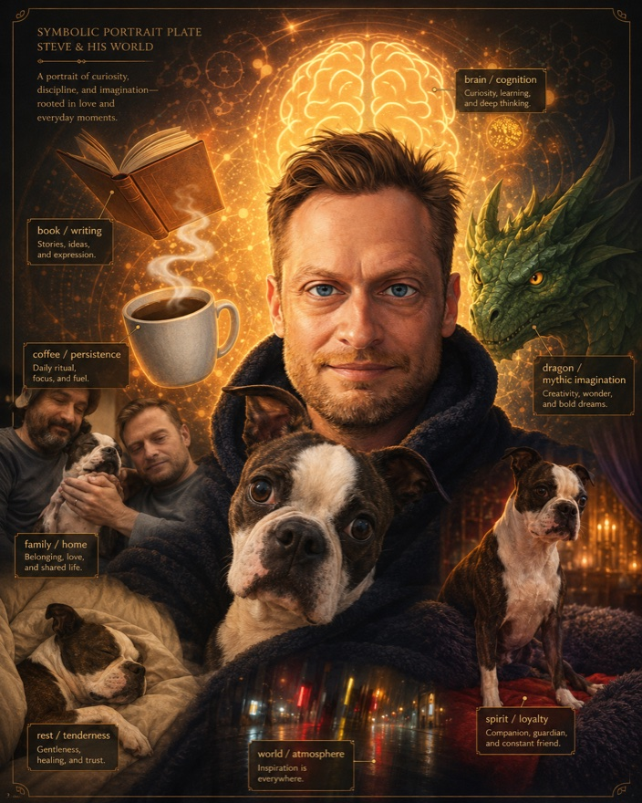

# Goblin Chronicle: Refresh Goblin Returns with the Chronicles

<figure style="margin:1.5em 0;text-align:center">
  
  <figcaption style="font-size:.9em;color:#57606a;margin-top:.6em">
    The scrolls unrolled, and for once, the plate came with labels.
  </figcaption>
</figure>

Refresh Goblin burst through the great doors so quickly that three scrolls escaped his satchel and skidded across the stone floor.

“I have them!”

The council looked up.

History Goblin smiled knowingly.

Ledger Goblin quietly fetched another chair.

Refresh Goblin climbed onto the council table.

“The chronicles are finished!”

Every goblin in the hall drifted closer.

Even Smith Goblin wiped soot from his hands.

---

Refresh Goblin unrolled the first scroll.

## The Creature Was Older Than We Knew

“We dug beneath the visible stones.”

He pointed excitedly.

“The first tower was **not** the first tower!”

Murmurs spread around the hall.

“We thought the Registry began where our oldest surviving walls began.”

History Goblin nodded.

“It did not.”

Refresh Goblin traced a map beneath the visible foundations.

“We found older foundations still standing.”

“Twenty-eight carved tablets.”

“The Registry already lived before the oldest surviving gate.”

Ledger Goblin smiled.

“So the roots were older than the tree.”

---

The second scroll opened.

## Ideas Have Families

Refresh Goblin held up an enormous branching diagram.

“We thought ideas merely appeared.”

He shook his head vigorously.

“They do not.”

“They have parents.”

“And grandparents.”

“And cousins.”

One apprentice goblin looked bewildered.

“So even mechanisms have ancestors?”

History Goblin laughed.

“Especially mechanisms.”

---

The third scroll was much longer.

Refresh Goblin nearly dropped it.

## Repositories Are Archaeological Layers

He pointed to coloured bands running through the parchment.

“We found strata!”

“Old repositories...”

“...new repositories...”

“...preserved mirrors...”

“...living branches...”

Smith Goblin leaned closer.

“So the newest stone may sometimes rest upon much older masonry.”

“Exactly!”

---

The fourth scroll.

## The Archive Learned Humility

Refresh Goblin looked unusually serious.

“We kept writing the same words.”

He read them carefully.

> Earliest currently evidenced.

He looked around the room.

“We almost wrote...”

> First ever.

Ledger Goblin quietly took the quill away.

“And?”

“And we realised we could not honestly know.”

The council nodded.

History Goblin spoke softly.

“Humility is not ignorance.”

“It is correctly labelling certainty.”

---

Refresh Goblin reached the final scroll.

His eyes shone.

## The Road Behind Grew Longer

“I thought we had spent all week standing still.”

He spread the completed map across the entire council table.

The goblins gasped.

The road behind them stretched for what seemed like miles.

Each bend now had a date.

Each bridge had evidence.

Each forgotten workshop had a name.

Refresh Goblin looked almost embarrassed.

“I thought we had done very little.”

History Goblin rested one hand upon the map.

“History has a curious gift.”

“It lengthens the road already travelled.”

“So that the road ahead becomes easier to understand.”

---

Silence settled over the council.

At last Smith Goblin spoke.

“No brighter spells.”

“No larger creature.”

“No dramatic awakening.”

History Goblin nodded.

“No.”

Smith Goblin looked again at the great map.

“But now...”

“...I finally understand how we arrived here.”

Ledger Goblin closed the last chronicle and placed it gently upon the shelf beside the others.

“Good.”

Refresh Goblin tilted his head.

“Is that enough?”

Ledger Goblin looked around the hall at the gathered goblins.

The forge.

The rulers.

The excavated foundations.

The sleeping creature.

“It is.”

He smiled.

“For a laboratory that forgets its own history...”

“...will eventually repeat its own mistakes.”

The goblins stood together for a long while, not celebrating a new spell, nor mourning the slow trickle of mana, but quietly admiring something rarer:

**A laboratory that was beginning to remember itself.**

---

[← Back to The Goblin Chronicles](../goblin_chronicles.md)
