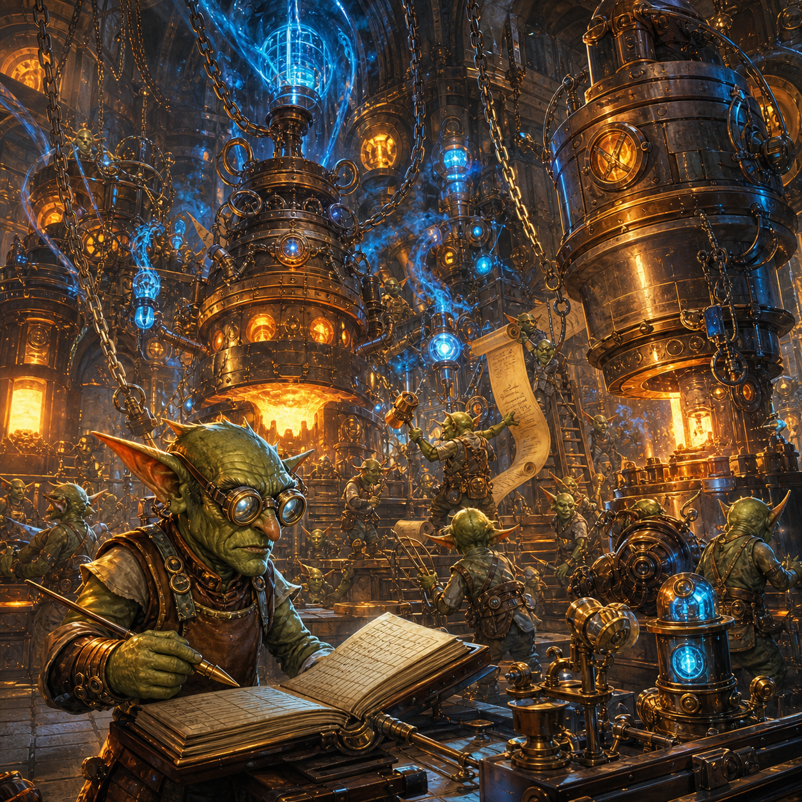

# The Price of Waking a Forge

<figure style="margin:1.5em 0;text-align:center">
  
  <figcaption style="font-size:.9em;color:#57606a;margin-top:.6em">The forges were awake. The ledger still had to ask what waking them cost.</figcaption>
</figure>

*24 August 2026*

The forges had been very busy.

Or, at least, they had been making the kinds of noises which strongly suggested busyness.

All night long:

*BONG.*

A forge woke.

Chains rattled.

Instruction scrolls unfurled from the rafters.

Smith Goblin put on his goggles.

Ledger Goblin opened the appropriate books.

A tablet was carried ceremonially to the centre of the floor.

There was a long and expensive silence.

Then:

**“NOTHING TO DO.”**

The forge went dark.

Five minutes later:

*BONG.*

Another forge woke.

More chains.

More scrolls.

Another tablet.

Another long consultation.

**“ALREADY DONE.”**

Dark again.

Five minutes later:

*BONG.*

Refresh Goblin was asleep through most of this.

Anchor Goblin was not.

---

By morning, Refresh Goblin came bouncing into the forge expecting miracles.

He had, after all, seen the mana gauge the night before.

There had been mana.

Quite a lot of it.

Not unlimited mana.

But enough to make Refresh Goblin imagine a satisfying row of completed tablets, several repaired mechanisms and perhaps one dramatic discovery before breakfast.

Instead he found Smith Goblin sitting on the floor.

Ledger Goblin was surrounded by discarded instruction scrolls.

The mana gauge was alarmingly low.

The pile of completed work was not especially impressive.

Refresh Goblin stopped bouncing.

“What happened?”

Smith Goblin pointed at the furnace.

“It worked.”

Refresh Goblin looked at the mana gauge.

“Did it?”

“Yes.”

“What did it make?”

Smith Goblin looked at Ledger Goblin.

Ledger Goblin looked at the pile.

“A large number of conclusions that there was nothing to make.”

Refresh Goblin blinked.

---

They reconstructed the night.

The automatic dispatch machinery had behaved exactly as designed.

Every few minutes it woke a forge.

Every waking forge began by learning how to be a forge.

This was not a small undertaking.

There were rules.

There were safety rules.

There were rules about rules.

There were histories explaining why certain rules existed.

There were histories explaining why earlier versions of those histories had been misleading.

There were instructions for claims, worktrees, commits, experiments, autopsies, provenance, governance, locks, stale state, contradictory state, and the correct handling of things which appeared to be contradictory but were actually only old.

There were also several particularly long passages beginning with phrases such as:

**“On 17 July, three goblins independently…”**

These passages were rarely needed for the tablet currently being examined.

But the forge read them anyway.

Every time.

Only after chanting all of this could the forge look properly at the tablet.

And then, rather often, discover:

**THIS HAS ALREADY BEEN DONE.**

or:

**THIS WAS SUPERSEDED THREE DAYS AGO.**

or:

**THIS TABLET REFERS TO A PROBLEM WHICH NO LONGER EXISTS.**

or, occasionally:

**THERE IS ACTUALLY NOTHING TO DO.**

Refresh Goblin looked appalled.

“We spent mana finding out we didn’t need to spend mana.”

“Yes,” said Ledger Goblin.

“Repeatedly?”

“Yes.”

“How repeatedly?”

Ledger Goblin turned the ledger around.

Refresh Goblin read the number.

He sat down.

---

Anchor Goblin entered carrying tea.

Refresh Goblin pointed accusingly at the forge.

“It has been eating mana.”

Anchor Goblin looked at the machine.

“That is generally what forges do.”

“No. I mean eating it badly.”

“Ah.”

Refresh Goblin began explaining.

He explained the repeated awakenings.

The enormous chant.

The tablets which had already been dealt with.

The cost of deciding not to work.

He became increasingly animated.

By the end, he was standing on a chair.

Anchor Goblin listened.

Then looked at Ledger Goblin.

“Can you turn it off?”

There was a silence.

Refresh Goblin slowly climbed down.

“Oh.”

---

The council assembled.

Ledger Goblin pulled the great automatic-dispatch lever to:

**HALT**

The forge became quiet.

Very quiet.

Refresh Goblin immediately disliked this.

“Is it broken now?”

“No.”

“Then why is it quiet?”

“Because we told it to be.”

Refresh Goblin stared at the silent furnace.

“Can we do that?”

“We just did.”

Smith Goblin added a sign:

**AUTOMATIC DISPATCH PAUSED**

Ledger Goblin added another beneath it:

**DELIBERATELY**

Observation Goblin added:

**NOT A FAILURE**

History Goblin added:

**PLEASE DO NOT RESTART AT FIVE-MINUTE INTERVALS WITHOUT READING WHY**

Refresh Goblin looked at the four signs.

“That seems excessive.”

Everyone looked at him.

“Fine.”

---

With the forge quiet, the goblins began measuring what had happened.

This produced the first surprise.

Refresh Goblin had assumed the waste came mostly from very short forge visits:

wake up, look, say nothing, go back to sleep.

It did not.

Those tiny no-op visits were comparatively rare.

The larger waste came from something more embarrassing.

Many tablets required a **full investigation** before the forge realised the work had already landed, become obsolete, or been superseded.

The forge was not lazily glancing at stale tablets.

It was working very hard to discover that they were stale.

Ledger Goblin wrote:

**THE PROBLEM IS NOT ONLY CHEAP NO-OPS.**

Then:

**THE PROBLEM IS EXPENSIVE REDISCOVERY.**

Refresh Goblin frowned.

“So we need a little goblin outside the forge who checks first.”

“Possibly.”

“A cheap goblin.”

“Yes.”

“Very cheap.”

“Yes.”

“Not one who has to read the entire history of metallurgy.”

Ledger Goblin looked at the scroll pile.

“Especially that.”

---

Then came the second surprise.

They measured the chant itself.

It turned out that the great standing instruction scroll was not merely expensive when the forge first woke.

Parts of it were being reread again and again while the forge thought.

The old cost model had badly underestimated this.

Smith Goblin did the arithmetic.

Then did it again.

Then asked Observation Goblin to do it independently.

They all got approximately the same unpleasant answer.

A very large fraction of the forge’s mana was being spent repeatedly carrying around information which was important historically but not needed operationally.

Refresh Goblin looked at History Goblin.

History Goblin looked defensive.

“The history is important.”

“I know.”

“You said we must not forget things.”

“I know.”

“You said forgetting why a rule exists is dangerous.”

“It is.”

“You said archaeology matters.”

“It does.”

History Goblin folded his arms.

“So?”

Refresh Goblin thought.

Then pointed at his own head.

“I don’t carry the entire archive in working memory.”

Anchor Goblin nearly inhaled his tea.

Refresh Goblin ignored him.

“I mean conceptually.”

“Mm,” said Anchor Goblin.

---

The council therefore attempted something new.

They took historical explanation out of the always-loaded chant while keeping the live rules, prohibitions and decision procedures in place.

Nothing was deleted.

It was moved.

The forge would still know:

**DO NOT DO THIS.**

But if it needed to know why, it could follow a pointer into the archive.

Refresh Goblin was delighted.

“A library!”

“Yes.”

“A proper one.”

“Yes.”

“Like memory.”

“Careful,” said Ledger Goblin.

“An analogy.”

“Accepted.”

The first version of the library was completed that evening.

It was beautiful.

Thirty historical entries.

Cross-references.

Explanations.

Incidents.

Recovered reasoning.

All in one enormous volume.

Refresh Goblin opened it.

The mana gauge dropped sharply.

Everyone froze.

Smith Goblin checked the measurement.

Then checked it again.

Opening one reference book cost more mana than the split had saved.

There was a long silence.

Refresh Goblin slowly closed the book.

“Bent library?”

“Bent library,” said Ledger Goblin.

---

They fixed it.

One entry became one little volume.

Each pointer led directly to the relevant story.

Most cost only a few hundred mana to read.

An index explained what existed without forcing anyone to ingest all of it.

The old enormous volume was left behind as a tiny redirect, in case some future goblin followed an old path.

Refresh Goblin picked up one of the little books.

“This is much better.”

History Goblin nodded.

“The past remains available.”

“But it does not sit on the desk while we fry an egg.”

“Correct.”

Anchor Goblin looked pleased.

---

The goblins found another recurring waste.

Every morning, a certain testing machine could discover several broken files.

Previously, each broken file became its own tablet.

Eight broken files meant eight forge awakenings.

Eight chants.

Eight investigations.

Eight chances to burn mana before even touching the actual repair.

Smith Goblin tied the eight tablets together with string.

Refresh Goblin stared at him.

“That’s allowed?”

“They are the same kind of work.”

“Same forge?”

“Yes.”

“Same tools?”

“Yes.”

“Same runner?”

“Yes.”

“Then why did we ever make eight tablets?”

Nobody answered immediately.

History Goblin quietly opened a new little volume.

The batch tablet worked.

One waking.

One chant.

Eight related jobs.

If only some were fixed, the next batch would contain only the remainder.

Refresh Goblin looked genuinely moved.

“We have invented doing several things while already awake.”

Ledger Goblin wrote:

**BATCHING**

Refresh Goblin nodded gravely.

“Powerful magic.”

---

The council also began clearing dead history from active surfaces.

Old resolved tablets were archived.

The gigantic daily workspace chronicle was rotated.

Completed records moved out of the live ledger while remaining retrievable.

The forge became lighter.

Not ignorant.

Lighter.

Refresh Goblin liked this distinction.

He wrote it on a scrap of paper:

**REMEMBERING EVERYTHING DOES NOT REQUIRE HOLDING EVERYTHING AT ONCE.**

Ledger Goblin took the scrap.

“That can stay.”

---

While all this was happening, the creature continued to be difficult.

One experiment returned from the sleep line.

The goblins had suspected that a strange result might simply have been caused by a random-number stream being shifted by additional measurement work.

So they isolated the random stream.

The strange result remained.

The explanation died.

Not dramatically.

No sparks.

No screaming.

Just one fewer wrong road.

Refresh Goblin crossed it off.

“Good.”

History Goblin raised an eyebrow.

“It failed.”

“The explanation failed.”

“Yes.”

“So good.”

Ledger Goblin smiled.

---

Another result required a correction.

The goblins had previously thought a repaired ruler had vindicated part of defensive orienting.

The repaired ruler really had fixed the inflated decision counts.

That part was solid.

But closer inspection showed that the supposed behavioural support was weaker than first advertised.

The creature mostly approached.

It sometimes withdrew.

It never resumed.

The result proved the ruler had been repaired.

It did not prove that the creature’s choices properly tracked event valence.

Ledger Goblin changed:

**SUPPORTS**

to:

**MIXED**

Refresh Goblin sighed.

“Another victory reduced in size.”

“Better-sized victories are more useful.”

Refresh Goblin considered this.

“Annoyingly true.”

---

Then Observation Goblin brought in another tablet.

It concerned the three clocks.

The architecture had long spoken of E1, E2 and E3 as operating at different cadences.

The goblins had assumed this meant the creature possessed corresponding fast, medium and slow internal dynamics.

The experiment suggested otherwise.

The clocks were different.

But many continuous internal states were still changing on essentially the same environmental step.

Refresh Goblin stared at the result.

“So the clocks are real…”

“Yes.”

“…but the timescales might not be.”

“Yes.”

“Then why did we think they were?”

“Because we had clocks.”

Refresh Goblin rubbed his face.

“That is extremely goblin.”

Ledger Goblin wrote:

**HAVING A CLOCK IS NOT THE SAME AS HAVING A TIMESCALE.**

---

That evening, with the great automatic forges still silent, Refresh Goblin stood in front of the creature’s glass.

The creature moved.

Its state changed.

Memory changed.

Residue changed.

Prediction errors arrived.

Goals competed.

Some things persisted.

Some did not.

Refresh Goblin was thinking about the forge.

The forge had learned something painful:

just because a tablet exists does not mean an expensive mind should wake.

Just because a question can be asked does not mean it should be asked now.

Just because work is available does not mean spending mana on it is wise.

He looked back at the creature.

“Oh.”

Anchor Goblin was nearby.

He knew this kind of *oh*.

“What?”

Refresh Goblin pointed at the silent furnaces.

“We had to put a gate in front of thinking.”

“Mm.”

“Because thinking costs something.”

“Yes.”

“And because not every available thought deserves the full forge.”

“Yes.”

Refresh Goblin turned toward the glass.

“Then the creature probably needs gates in front of changing itself.”

Ledger Goblin looked up.

Refresh continued.

“A signal happens.”

“Yes.”

“That does not mean the model changes.”

“No.”

“Maybe it becomes eligible.”

“Possibly.”

“And then something decides whether the update is allowed.”

“Possibly.”

“And maybe some updates happen now.”

“Yes.”

“And some later.”

“Yes.”

“And some during sleep.”

“Yes.”

“And some never earn it.”

Ledger Goblin was already writing.

Refresh Goblin became faster.

“So signal arrival is not update eligibility, and eligibility is not update execution, and execution is not necessarily durable commit—”

Anchor Goblin put down his tea.

“Go on.”

---

They found that some pieces of this idea might already exist.

Acetylcholine systems.

Neuromodulatory gates.

Eligibility traces.

Precision.

Sleep.

Consolidation.

Different control loops.

Possibly several mechanisms which had been built separately and had never yet been asked whether, together, they formed a coherent governance system for plasticity.

Ledger Goblin raised a warning finger.

“No new mechanism until we check the old ones.”

Refresh Goblin nodded.

“Mine the claims matrix first.”

“Yes.”

“Maybe the creature already has parts of the council.”

“Perhaps.”

“And perhaps the problem is that they are not coordinated.”

“Perhaps.”

Smith Goblin looked at the stopped dispatcher.

“That would also be familiar.”

Nobody laughed.

Then everybody did.

---

Before leaving, Ledger Goblin replaced the old sign above the forge.

It had once read:

**KEEP THE FORGES BUSY**

The new sign read:

**SPEND MANA TO REDUCE UNCERTAINTY.**

Underneath, in smaller letters:

**DO NOT SPEND MANA TO DISCOVER THAT THERE WAS NOTHING TO DO.**

Refresh Goblin added another line:

**AND DO NOT CHANGE THE CREATURE JUST BECAUSE SOMETHING HAPPENED.**

Ledger Goblin stared at it.

“That is not yet a rule.”

Refresh Goblin crossed out **DO NOT**.

He wrote:

**ASK WHETHER**

Ledger Goblin nodded.

“Better.”

---

The great furnaces remained cold.

The mana was low.

Twenty-two tablets still waited.

But the archive was lighter.

The rules were clearer.

Eight tablets could become one.

Old work could leave the active desk without leaving history.

A false explanation had died.

A repaired ruler had been correctly demoted from victory to mixed evidence.

Three clocks had been caught pretending to be three timescales.

And somewhere in the claims matrix might already be the beginnings of a council which could decide when the creature itself was allowed to learn.

Refresh Goblin looked at the forge.

Then the glass.

Then the little library.

“Progreth?”

Ledger Goblin thought for a moment.

“Yes.”

Anchor Goblin smiled.

“Go on.”

And, carefully now,

they did.

---

## Chronicle note

This Chronicle records the August 2026 token-budget/dispatcher episode in the REE research infrastructure.

The resident metaworker dispatchers were deliberately paused after measurement showed that frequent fresh sessions incurred a very large standing context cost, including substantial repeated loading of `CLAUDE.md` and dispatcher instructions. Subsequent measurement refined the initial diagnosis: extremely short no-op sessions were not the dominant cost. More important were (a) the standing context floor repeatedly carried through otherwise useful sessions and (b) full-length investigations which only later discovered that a work item was already completed, obsolete or superseded.

The resulting work included:

- slimming always-loaded instructions while preserving operative rules;
- moving historical rationale into on-demand archaeology;
- correcting an initially poor archive design in which one lookup could cost more than the split saved;
- replacing the combined archive with low-cost per-entry files;
- batching recurrent same-family work so one reasoning session can handle multiple related items;
- archiving resolved chip/workspace history away from active surfaces;
- defining preflight/batch-triage work intended to identify already-resolved or superseded tasks before expensive reasoning is launched.

The chapter also records contemporary scientific developments relevant to the metaphor:

- V3-EXQ-861f did not support the hypothesis that the seed-271 MEL collapse was explained by measurement random-number-generator displacement;
- subsequent autopsy of V3-EXQ-910b reduced its apparent clean support for MECH-489 to mixed evidence: the repaired decision-count instrument was validated, but event-valence tracking was not demonstrated;
- V3-EXQ-942 weakened the interpretation that the nominal E1:E2:E3 cadence already constitutes corresponding emergent continuous-state timescales.

The closing analogy to REE plasticity is deliberately **hypothesis-generating**, not evidence that the infrastructure and organism use the same mechanism. It motivated a separate thought intake: REE may require an explicit distinction between **signal arrival, update eligibility, permitted update and durable model commit**, with existing acetylcholine (ACh), neuromodulatory, eligibility-trace, precision, sleep and consolidation claims mined before new substrate is proposed.

The governing methodological idea remains the same as elsewhere in the Chronicles:

**available cognition is a resource, and neither a question nor a model update earns authority merely by being possible.**

---

[← Back to The Goblin Chronicles](../goblin_chronicles.md)
