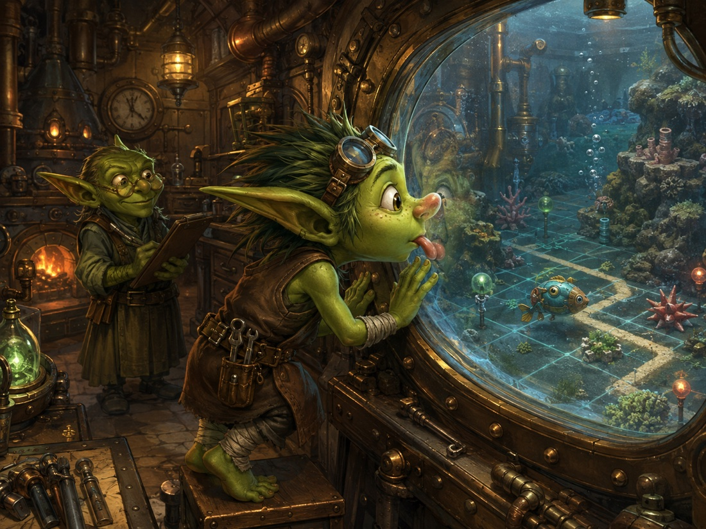
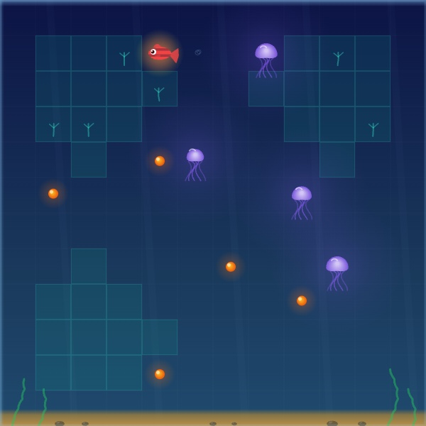

# Goblin Chronicle: The Day the War Ended and the Creature Stirred

For a very long time, the Forge had sounded like war.

Not the heroic sort.

There were no cavalry charges.

No banners.

Mostly there were pipes.

Pipes carrying messages.

Pipes reporting upon other pipes.

Little machines whose purpose was to notice whether larger machines had stopped noticing the machines beside them.

There were ledgers about ledgers.

Heartbeats announcing that something was alive.

Heartbeats announcing that something else had stopped announcing that it was alive.

Workers waking other workers.

Workers checking whether the workers who woke workers were themselves awake.

And everywhere—

Git.

Refresh Goblin had once asked what Git was.

Nobody had given him an answer he found satisfactory.

Eventually he decided it was a kind of weather.

---

For months, the goblins fought.

Smith reinforced the Forge.

Coordinator laid new roads between its workshops.

Ledger wrote rules about who could touch which hammer.

Observation built gauges.

History recorded which explosion had taught them not to put that particular valve there.

Whenever one problem returned, they made a tablet.

When it returned again, they made a notch.

When it returned a third time, someone finally went looking for the pipe.

The hoard had learned something important:

> One problem, one tablet.  
> If it happens again, add a notch.  
> If it keeps happening, find the pipe.

And there were **many pipes**.

---

Eventually the goblins noticed something embarrassing.

They had built a magnificent machine for doing science.

And much of its work consisted of maintaining the magnificent machine for doing science.

Mana poured in at one end.

Smoke came out of the other.

Refresh Goblin stared at it.

“Thience?”

Smith looked at the gauges.

“Not exactly.”

“Progreth?”

“Operational continuity.”

Refresh frowned.

“Did we build a machine for keeping the machine that buildth the creature able to keep building the creature?”

There was a long silence.

Ledger closed his eyes.

“Yes.”

Refresh looked horrified.

“That ith a terrible machine.”

Smith shrugged.

“It was a prototype.”

---

So another campaign began.

Not to make the Forge larger.

To make it **less necessary to think about**.

Old signalling roads were closed.

Heartbeats stopped being carved into stone merely so one machine could tell another machine it was still there.

The Hub became the place where living things spoke.

Git returned, slowly, toward its proper vocation:

remembering the science.

The goblins built new pipes beside the old ones.

For a while this made everything worse.

Refresh named this period **Thoak**.

> **THOAK: WHEN IMPROVEMENT TEMPORARILY REQUIRES TWICE AS MUCH PLUMBING.**

Every old pipe remained.

Every new pipe had to be watched.

Every message had to travel twice.

Then the two copies had to be compared.

Then somebody had to check that the thing checking the copies had not itself become another pipe requiring permanent maintenance.

Refresh Goblin hated Thoak.

Everybody hated Thoak.

Ledger insisted it was temporary.

Refresh did not believe him.

Then, rather unexpectedly—

it was.

---

The tests passed.

One old pipe was shut.

Then another.

The heartbeats stopped scratching themselves into Git.

Workspace state ceased demanding a permanent stone inscription.

The new Hub kept speaking.

Workers still worked.

Nothing fell over.

The goblins waited for catastrophe.

Catastrophe, apparently busy elsewhere, did not arrive.

Refresh crept into the Forge.

There were spaces where machinery used to be.

Not broken machinery.

**Absent machinery.**

He gasped.

“Ledger!”

Ledger came running.

Refresh pointed.

“Where ith it?”

“Where is what?”

“The machine.”

“Which machine?”

“The one that kept the other machine informed about the machine.”

Ledger looked at the empty patch of floor.

“We removed it.”

Refresh stared.

“You can do that?”

“Yes.”

Refresh looked around suspiciously.

“Are there other thingth we can remove?”

Smith, from somewhere beneath a workbench:

“Hundreds.”

Refresh's eyes widened.

---

And then something happened which had become almost unfamiliar.

The Forge stopped being the story.

A goblin entered the laboratory carrying an experiment.

Then another.

The furnaces were hot.

Workers moved independently.

Governance corrected claims while experiments ran.

Smith changed substrate while Observation watched another mechanism elsewhere.

The queues emptied and filled.

Some experiments passed.

Some failed.

Some passed and were later told by Governance that they had not passed in quite the way they thought they had.

Ledger was delighted by this.

Refresh was not.

“Patht meanth patht.”

“No.”

“Then why do we write PATHT?”

“Because the run passed its registered decision rule.”

“So it patht.”

“The scientific interpretation may still be non-contributory.”

Refresh considered this.

“That ith a terrible word.”

“It is an excellent word.”

---

Governance went through the old battlefields.

Twenty-three unresolved results were brought out.

Some were real failures.

Some were broken measurements.

Some had been interpreted too generously.

Some too pessimistically.

Two conclusions changed under adversarial review.

Several apparently separate problems turned out to share the same root.

Refresh watched Governance draw circles around the map.

At first there were dozens of marks.

Then one very large circle appeared around most of them.

Refresh leaned closer.

“What ith that?”

“The observation-to-world-model interface.”

“And all thothe problemth?”

“A surprising number appear to pass through it.”

Refresh blinked.

“So we do not have thirty-nine problemth?”

“We have thirty-nine consequences.”

“Of?”

Ledger tapped the large circle.

“A much smaller number of problems.”

Refresh stood completely still.

This was extremely unusual.

Then he whispered:

“Progreth.”

---

Smith went to work.

E1 learned a new way to be trained across several predicted steps rather than only one convenient step at a time.

The experiment moved it.

Not enough.

Not consistently.

But it moved.

Governance refused to call that a victory.

So the question became smaller again.

Good.

Then Smith opened another part of the creature.

There was information entering the creature about where useful things were.

Not merely whether they were nearby.

**Where.**

A little field of direction.

The creature could see it.

But somewhere between seeing and representing, much of that structure disappeared.

A separate reader given the missing directional information could forage.

A reader given only the creature's internal world representation could not.

So Smith added a new training pressure.

Not an oracle.

Not a new road around the creature.

A demand placed upon its own representation:

**if direction matters to what you can do, preserve direction.**

The new piece landed.

Twenty-five little directions now had a path by which they could teach the creature's world representation not to throw them away.

No one knew yet whether this would make the creature forage properly.

The experiment still had to be run.

Ledger wrote, very firmly:

> IMPLEMENTED PENDING VALIDATION.

Refresh read it.

“Could we jutht write ‘might actually help’?”

“No.”

“It might.”

“Yes.”

“So—”

“No.”

---

Elsewhere, E3 was being examined more carefully.

Old measurements had asked which signal changed most over time.

That had seemed reasonable.

It was not the same question as asking which signal actually distinguished one possible action from another **at the moment of choice**.

So the ruler changed.

The creature had not changed.

The goblins had learned to look at it better.

A long experiment began.

Another developmental experiment began beside it.

Neither waited for the other.

The Forge simply gave them somewhere to work.

Refresh stood at the observation window.

Two experiments were running.

Governance was still cleaning the archive.

Smith was changing the creature.

The old heartbeat machinery was mostly quiet.

Nobody was repairing Git.

Nobody was shouting.

For several minutes, Refresh could not work out what was wrong.

Then he realised.

Nothing was wrong.

---

He found Ledger in the council chamber.

“Ledger.”

“Yes?”

“Did we win the war?”

Ledger looked up.

“What war?”

“The Forge war.”

Ledger considered the question carefully.

There had been no declaration.

No surrender.

No final battle.

Nobody had driven a sword into a server and shouted victory.

They had simply kept removing reasons to fight.

The Forge had become sturdier.

The goblins had become better at stopping.

The machinery remembered enough that mana exhaustion no longer meant forgetting where everything was.

The live nervous system increasingly lived where live nervous systems belonged.

The scientific record increasingly contained science.

Some old fortifications remained.

Some pipes still needed removal.

There would certainly be more repairs.

There were always more repairs.

But that was not the same thing as war.

Ledger nodded.

“I think so.”

Refresh's mouth fell open.

“We won?”

“We stopped needing to fight it all the time.”

Refresh thought about this.

“That ith a very Ledger way to win a war.”

“Yes.”

---

They walked together to the old Forge courtyard.

There were empty patches everywhere now.

History had labelled some of them.

HERE STOOD THE HEARTBEAT GIT MATERIALISER.

HERE STOOD THE WORKSPACE-STATE PIPE.

HERE STOOD THREE MACHINES WHICH EXISTED BECAUSE THE FIRST MACHINE WAS UNRELIABLE.

Refresh found this last plaque particularly satisfying.

Beyond the courtyard was the laboratory.

Beyond the laboratory—

the creature.

Small.

Unimpressive.

Still profoundly incompetent at an impressive variety of things.

Nobody mistook it for a person.

Nobody declared consciousness.

Nobody declared general intelligence.

Nobody rang a bell and announced awakening.

But it was no longer true that nothing was changing inside it.

Its actions could affect its predictions.

Its history could leave persistent distinctions.

Escapable and inescapable harm could produce different internal consequences.

Replay pathways which had once been accidentally unreachable were becoming reachable.

E3 was gaining real information with which to rank possible actions.

E1 was being trained to preserve consequences across predicted futures.

And now the world's directional structure was being asked to survive inside the world model rather than disappear at the door.

These were not decorations around the creature.

They were changes **to the creature**.

Refresh pressed his face against the view glass.

*thwick*

Ledger waited.

Refresh did not speak.

After a while Ledger asked:

“Progreth?”

Refresh remained against the glass.

“Yeth.”

“How much?”

“I do not know.”

“Good.”

“Awake?”

“No.”

Refresh watched.

Something moved.

Not metaphorically.

Not because a dashboard refreshed.

Not because a worker had committed a file.

The experiment was running.

The architecture was changing.

The behaviour could now answer questions it could not previously answer.

Refresh peeled his tongue from the glass.

“Thtirring?”

Ledger looked through the window.

For once, he did not correct him.

“Thtirring.”

---

Behind them, Smith extinguished one of the Forge's old furnaces.

Nobody noticed.

That was the point.

Ahead of them, the little creature moved through its tiny world.

And for the first time in a while, almost all of the goblins were looking in the same direction.

Not at the Forge.

Not at the pipes.

Not at Git.

At the creature.

The war was over.

**Science had started again.**

---

<figure style="margin:1.5em 0;text-align:center">
  
  <figcaption style="font-size:.9em;color:#57606a;margin-top:.6em">
    <em>thwick.</em> Refresh Goblin, against the view glass.
  </figcaption>
</figure>

<figure style="margin:1.5em 0;text-align:center">
  
  <figcaption style="font-size:.9em;color:#57606a;margin-top:.6em">
    What was actually on the other side of the glass — the REE Fishtank viewer, mid-episode on the SD-018 directional-field lineage. V3-EXQ-978, the run this chronicle ends on, is that lineage's newest chapter, running now.
  </figcaption>
</figure>

---

[← Back to The Goblin Chronicles](../goblin_chronicles.md)
