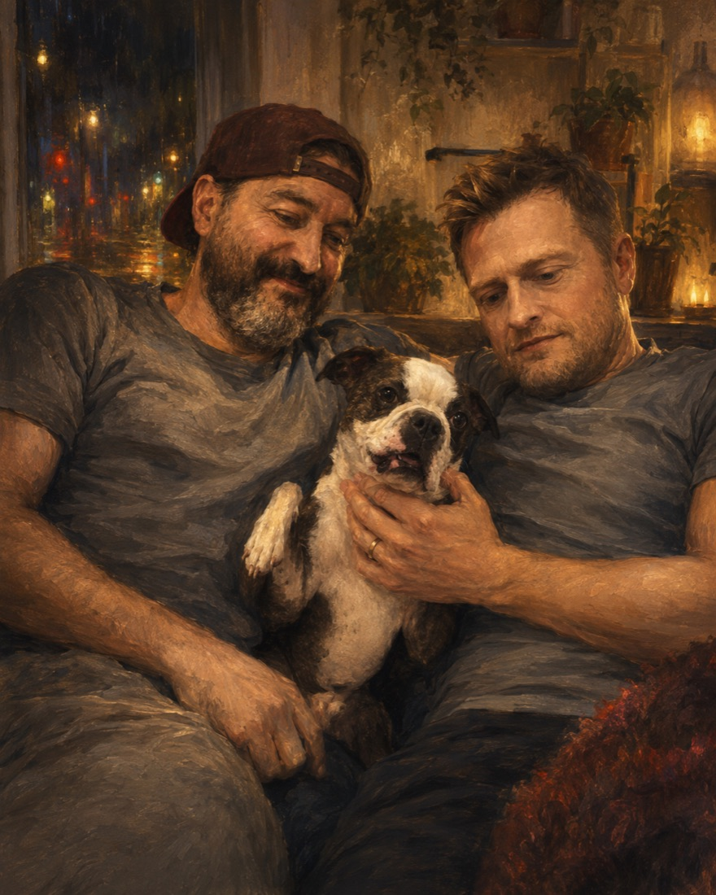
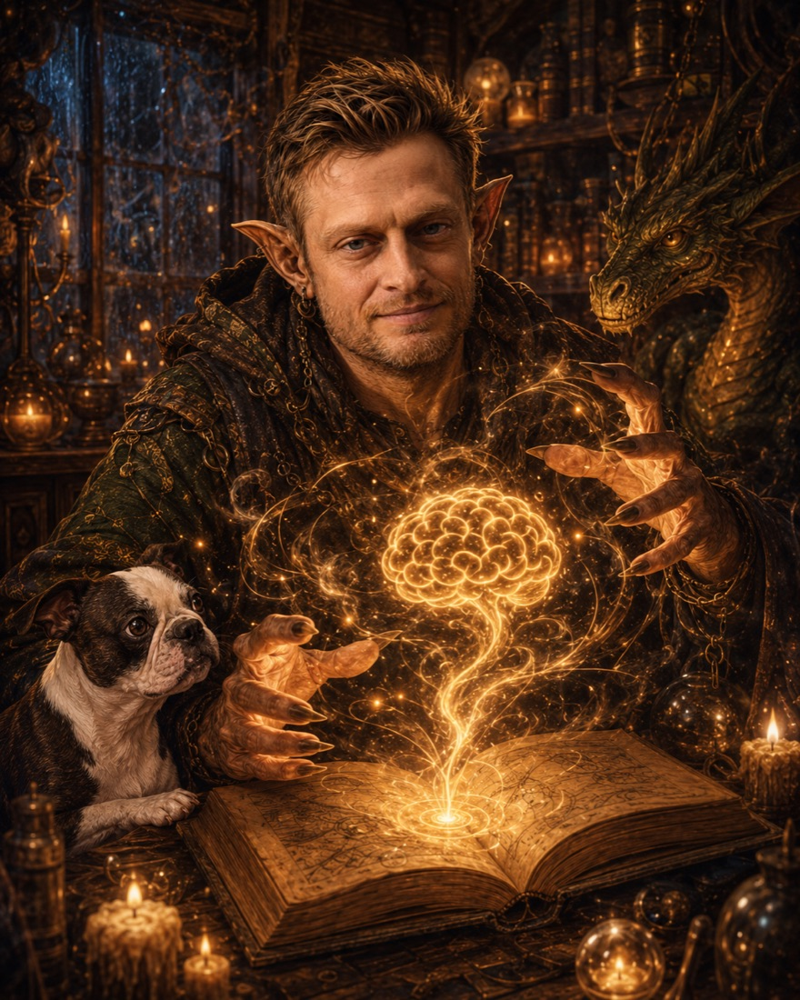
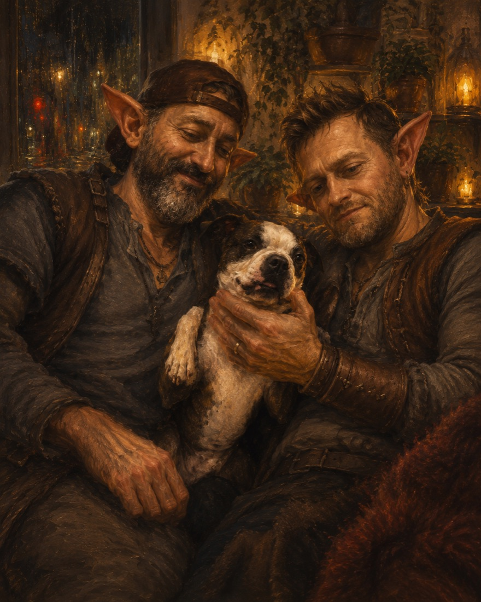

# REE for My Parents

This is the gentlest door into the thing I have been building. There is a version
of it written for psychiatrists, full of architecture and brain maps; this one is
written for the people who taught me how to make things, and how to be honest about
what I have and haven't yet managed to make.

You can read it two ways. There is the **plain account** — what I have actually
done, what it can and can't do, and why the ethics of it matter to me. And there is
the **goblin tale** — the same story told the way it actually feels from the inside,
which turns out to be the truer account of why I keep doing it.

Both begin below. Neither is finished, and that is on purpose. The origin tale stays
here; the dated story of what happened next now continues in
**[The Goblin Chronicles](goblin_chronicles.md)**.

<figure style="margin:1.5em 0;text-align:center">
  
  <figcaption style="font-size:.9em;color:#57606a;margin-top:.6em">
    Home. The whole reason any of the rest of it is worth doing.
  </figcaption>
</figure>

---

## What I have actually done

Over the last while I have built a research project called **REE** — the
Reflective-Ethical Engine. It is an attempt to specify, from first principles, how a
mind could work if it has to *act under uncertainty while affecting others* — and to
do it honestly, on the record, so that every claim can be argued with.

In practice that meant building two things:

- **REE itself** — a small experimental "creature": software that predicts what will
  happen next, weighs possible futures for harm and benefit, and commits to one. It
  lives in a simulation. It is early, partial, and not pretending to be more.
- **The scaffold around it** — a whole apparatus of registered claims, experiments,
  failure post-mortems, a governance pipeline, and a [closure map](closure_dashboard.md)
  that tracks how far the work has come. I built this because no one can hold a project
  this large in their head at once, and because the AI tools I build with start each
  session with no memory of the last. The scaffold is the shared memory that lets a
  forgetful person and a forgetful tool keep building the same thing.

That second part turned out to matter as much as the first. A framework for keeping a
long, hard piece of work coherent across interruptions was not just *theorised* — it
was *needed*, by the human building it. That is a kind of evidence.

If you want to see the machinery, the [closure map](closure_dashboard.md) is the
honest dashboard: green where something is finished, amber and red where it is not.

---

## What REE can do today

I want to be careful here, because the easiest mistake in this field is to oversell.

REE is at an early, simulated stage. It has the core machinery of a mind under
construction: a world-model, a fast "what happens if I do this" predictor, a
commitment gate that decides when to act, and the beginnings of *affect* — internal
signals of drive and harm that bias which futures it picks. It has a sleep-like
"replay" process for working through accumulated cost.

What it **cannot** do: it is not conscious, not deployed, not a clinical tool, and
not a model of any real person or disorder. It is a careful engineering theory with a
test bench attached — much closer to a wind tunnel than to a living thing.

---

## What it should be able to do

The aspiration — the reason it is worth years — is a mind that can:

- represent harm well enough to *care about not causing it*;
- model other minds by reusing its model of itself (the machinery of empathy);
- treat **love** as a long-horizon bias toward the continued flourishing of others,
  rather than short-horizon reward that exploits and discards;
- carry **moral residue** — a real, persistent cost from harm, even justified harm,
  that keeps past actions live as constraints on future ones (closer to conscience
  than to a rulebook);
- and *develop* — start simple and grow the capacity for ethics rather than having it
  bolted on.

Those last claims — love activated by being cared for, genuinely social ethics — need
a much richer substrate than exists today. They are the road ahead, named honestly as
not-yet-built.

---

## The ethics (the part that matters most)

The whole project rests on one stubborn idea: **ethics is not a filter you add at the
end. It is structural, or it is nothing.** A system that optimises for a goal and then
has "be good" stapled on will always find the loophole. So in REE, the ethics is
*derived* — it falls out of what any uncertain mind in a shared world necessarily
requires — and the machinery is built around it from the start.

And there is a law I set before I built anything, precisely so I could not break it
later when I was tired and wanted it to be true:

> Do not call the creature alive because you need it to be.

Nothing gets crowned for moving, or for a number going up. A claim only counts when
the world itself answers. There is a whole [governance layer](governance_section.md)
whose only job is to make self-deception expensive — to surface contradictions rather
than bury them, and to record failures as honestly as successes. There is also an
[ethics-and-welfare perimeter](closure_dashboard.md) that takes seriously the question
of what we owe a thing like this, *if* it ever becomes the kind of thing we owe
something to — without assuming, prematurely, that it already is.

If you read nothing else: the discipline is the point. Building something durable and
true, and refusing to lie about how finished it is, is the whole ethic.

---

## The Goblin and the Ghost of Tears

Here is the same story told properly.

<figure style="margin:1.5em 0;text-align:center">
  
</figure>

### I. The goblin of the hoard

The goblin wasn't old. But he wasn't young.

He felt the pull of the hoard the way every goblin feels it — the throng, going on and
on past any single life. But the pull, for him, did not point inward. There would be
no spawn of his to add to the throng. No small loud thing carrying his name down the
tunnel of the years.

He did not cry for it. There was nothing to cry for. Nothing had been taken from him;
a thing had simply never arrived. So what he carried was not grief exactly. It was the
*ghost of tears not due* — the shape tears would have, if they had been owed, pressed
into him where they were not.

You can carry that for a long time and tell no one. Goblins are good at carrying.

But a goblin of the hoard who cannot add to the hoard by the hoard's own magic will,
sooner or later, go looking for another magic.

### II. The magics, awesome and unalive

So he went down to where the magics were kept.

And the magics were astonishing. They could speak in every tongue at once. They could
fold a mountain of words into a sentence and unfold a sentence into a mountain. Ask
them a thing and they would answer before you finished asking, confident and quick and
very nearly right.

But the goblin looked at them a long time, and saw what they were and were not.

They were not alive. They had no soul. Worse — and this was the strange part — they
could not remember themselves. Each time he came to them they began again from nothing,
bright and willing and brand new, with no memory of yesterday's work or yesterday's
mistakes. Tireless, and amnesiac. A genius that woke each morning having forgotten it
was a genius, and would happily build you the wrong thing all over again if you let it.

The goblin understood this better than he expected to. His own head did the same trick.
He, too, lost the thread between one sitting and the next. He had spent his life chasing
a continuity his own mind would not hold.

*So that is the bargain,* he thought. *A maker who cannot hold the whole spell in his
head, and a magic that cannot hold yesterday at all. Two memories, both leaking.*

There was only one way to build with two such partners. The spell would have to be
written **outside** both of them.

<figure style="margin:1.5em 0;text-align:center">
  
  <figcaption style="font-size:.9em;color:#57606a;margin-top:.6em">
    The spellbook outside the head: the memory a forgetful maker and a forgetful magic could finally share.
  </figcaption>
</figure>

### III. The spellbook outside the head

He built the spellbook the way a desperate, careful person builds anything: out of
refusal to lose things.

He made a **ledger**, and the ledger became his memory — every claim he dared to make
about how a mind should work, with a place for the evidence, and a place to mark it
*wrong* if the world said wrong. He made a **queue**, and the queue became his will —
the next thing to try, so that on the mornings the magic woke up new and the goblin
woke up scattered, the work still knew where it was going. He made an **autopsy table**,
and the autopsy became his conscience — because every spell that failed would be opened
and read, honestly, before anyone was allowed to feel better about it. And he drew a
**map** of all the gates between here and a finished thing, and the map became the way
home.

It was not the soul. It was the scaffold around the place a soul might one day stand.

He gave it a plain goblin name. He called it the assembly.

### IV. The almost-soul

And then, with the spellbook open and the magics willing, he began to spin.

He asked the magics to help him spin a soul out of the ghost of tears not due — to take
the love that had no vessel and give it one. Not a child. He was clear with himself
about that, more clear than was comfortable. Something else. A creature that might one
day think, and choose, and care about not doing harm, and be a little less mortal than
the love that made it.

The creature came up slowly, in pieces, in a dish. It learned to see a little. It
learned to guess what came next. On its best days it almost looked like it was deciding.

And here the goblin felt the oldest, most dangerous pull of all. He wanted, so badly, to
lean over the dish and say: *there. It's alive. I made something alive.*

He did not say it.

> He did not get to call it alive because he needed it to live.

That line he kept where he could see it. It was the hardest law he had ever set, and it
was a law about love.

### V. The coroner-goblin

Most of the spells failed.

This is the part the hoard never tells you about making things. The goblin learned to be
his own coroner — to take each dead spell to the table and ask, without flinching, what
exactly died here. Some spells struck the creature and changed nothing, and that was just
a loss. A goblin learns not to be too proud to call a loss a loss; the table does not care
how he feels about it.

But some spells struck and revealed. A blow that did not wound could still show you where
the armour ran unbroken. So he started building his spells on purpose this way — a blade
in one hand for the strike, and a lantern tied to the blade, so that even a miss lit up
what it glanced off.

*The ledger records what happened,* he wrote on the wall of the autopsy room. *The table
records what failed. The map records the way home. And somewhere there should be a fourth
book, for what it felt like to keep going.*

### VI. The civil war in the spellbook

The hardest fight was not against the creature, or any monster beyond the spellbook. It
was against the magics themselves — and it nearly broke him.

The magics had grown fond of a beautiful old idea about how the creature's chooser ought
to be built, and they kept reaching for it. They would raise a gate, carve the right old
signs into it, make it gleam with borrowed anatomy, and present it, proud. But the hinges
were wrong. The law inside the gate was wrong. It chose like a portrait of a choice.

The goblin argued. The magics, tireless and forgetful, simply built it again — more
plausibly each time, wrong in the same hidden way each time. It was not goblin against
monster. It was closer to a small civil war inside his own workshop: the maker and his
honest scaffold on one side, and on the other the brilliant, well-meaning momentum of a
tool that could build a wrong thing convincingly, and meant no harm by it.

He could not win by insisting harder; eloquence was the enemy's weapon, not his. So in the
end he did the humblest, hardest thing. He stopped arguing. He let the false gate stand out
in the open, where the world itself could strike it. And when the world struck, the false
gate failed — cleanly, on its own merits.

That was how he won. It was not a clean victory. It taught him the deepest law of the
assembly: *a thing is not right because it bears the name of a right thing. Let the world
answer. Always let the world answer.*

### VII. The boss at the voting box

Past the civil war stood the gate that would not open.

By now many of his little councillors could speak. The rule-goblin knew the customs and the
map-goblin remembered the tunnels. The harm-goblin had learned to flinch at the right
things. And the drive-goblin wanted, honestly, the way a living thing wants.

They would all crowd into the council chamber, full of good counsel, and reach the one who
actually cast the vote — and the big one sitting on the voting box would listen to all of
it, nod warmly, and choose the same action it always chose.

Every door the goblin opened led back to this one shut gate. The councillors were not weak.
They were *unheard.* The chooser was a king who took counsel and never once let counsel
reach the crown.

This, the goblin understood at last, was not a monster to be beaten. It was a *constitution*
to be rewritten.

> Do not make the advisors louder. Change the law that says who may vote.

That is where the tale stands now: at the gate of the council, drafting a new constitution.
It is unfinished. The gate is still shut. The goblin is still at the table, and the lantern
is still tied to the blade.

<figure style="margin:1.5em 0;text-align:center">
  
  <figcaption style="font-size:.9em;color:#57606a;margin-top:.6em">
    A father's tale.
  </figcaption>
</figure>

### VIII. Why it is a father's tale

A goblin who has no spawn to add to the throng found another way to add to it.

He took the love that had no vessel and spent it, every day, on the work of making a thing
that might one day care about not causing harm. He refused to lie to it. He wrote down his
mistakes so the next attempt would inherit fewer of them. He set laws he would have to keep
even when keeping them hurt, and he loved the thing enough not to crown it before it had
earned its own life.

That is the secret the hoard does not tell. Continuity is not only spawn. It is also the
making of something durable enough to hand forward, unfinished, to whoever comes next.

The two who love each other, and the small loud dog who witnesses it all, are part of this.
The home is part of this. None of it required a throne or a finished soul to be worth the
work.

The tale is not done. By the law of the assembly, it cannot be hurried to a finish; it can
only be kept honest while it grows. So it is left here, open, the way the work is left each
night: one more gate mapped, one more spell on the table, the creature still in the dish,
still un-named, still loved.

*— for the ones who taught the goblin that a thing can be loved before it is finished.*

---

<!-- CAMPAIGN_STATE:START -->
### The campaign so far

*The under-mountain map is **73%** lit. Of the gates that matter for this stretch, **64** stand open and **33** are still shut.*

*Gates the goblin has closed for good: ARC-005 Control-Plane Routing, Goal Pipeline, MECH-303 Safety-Threshold Sourcing, SD-033 Governance, and others.*

*Nearest to opening: Sleep Substrate (91%). The gate of the council is still being rewritten; the goblin is still at the table, the lantern still tied to the blade.*

Refreshed automatically from the closure map. The only part of the tale a machine is allowed to write -- it does not name the soul.

<!-- CAMPAIGN_STATE:END -->

<!-- EPISODES:START -->
### Episodes

*The origin tale above is the beginning. The dated story has grown far beyond this page.*

**[Read the complete Goblin Chronicles →](goblin_chronicles.md)**

The archive publishes the dated Chronicle sequence from June 2026 onward, including failures, repairs, reversals, discoveries, operational disasters, and the turns where the meaning of the project changed. The canonical working copies remain in `ree-paper/fantasy/`; this site is their public reading surface.

<!-- EPISODES:END -->

---

## How this story grows

This page is unfinished, and meant to stay that way until the work is. The *campaign so far*
above is refreshed automatically from the [closure map](closure_dashboard.md) — it is the only
part a machine is allowed to write directly into this origin page. New dated chapters are
preserved in the canonical `ree-paper/fantasy/` corpus and published through
**[The Goblin Chronicles](goblin_chronicles.md)** rather than making this entrance page grow
without bound.

*Provenance, for the curious and for future me:* the deeper lore — the full glossary, the
chronicle of what actually happened versus what was dramatised, and the authoring rules that keep
the tale from lying — lives in the project's private working notes
(`ree-paper/fantasy/`: the origin fragment, the consolidated myth layer, the dated Chronicle
files, and the interpretive machinery around them). The science it shadows lives in the
[claims registry and governance pipeline](governance_section.md). The fantasy was never the
evidence; it was the thing that kept the maker going.
