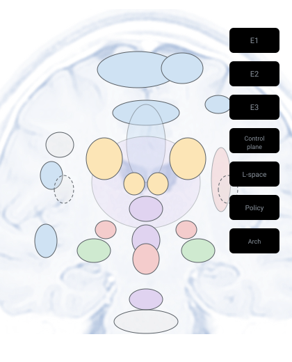

# REE for Psychiatrists

A six-part introduction to the Reflective-Ethical Engine written for practising
psychiatrists — no machine-learning background assumed. It moves from the
philosophical foundations, through the architecture and its brain mapping, to a
clinical "computational psychopathology" mapping and the governance method that
keeps the programme honest.

**Companion project:** the failure-mode → syndrome mapping previewed in Part 5 is developed in
depth in the **[AI Cognitive Failure Taxonomy](https://github.com/Latent-Fields/ai-cognitive-failure-taxonomy)**
— a structured, *bidirectional* correspondence between AI architectural failure modes and clinical
psychopathology (clinical precision for AI safety; computational predictions back to psychiatry).

**Live deck:** [REE — The Reflective-Ethical Engine: Intro for Psychiatrists](https://docs.google.com/presentation/d/1bkyjZRHA9BYtNICHPhDIGIZaPMoGjeL4Z-q3fCdlv5I/edit)
(Gamma → Google Slides; author's working copy — share/publish before circulating).
The slide text is reproduced below so it is searchable and readable without the deck.

  <iframe src="https://docs.google.com/presentation/d/e/2PACX-1vQSwiybqADrr2Y4sF7shoW3m6hOOnUL1_T36JgNovMiQxEW47sW1UM0S9i9iD6B9YC-27MoybjcocK2/pubembed?start=true&loop=true&delayms=3000"
    frameborder="0" allowfullscreen="true" mozallowfullscreen="true" webkitallowfullscreen="true"
    style="position:absolute;top:0;left:0;width:100%;height:100%;border:1px solid #d0d7de;border-radius:8px"></iframe>

*The interactive deck above auto-advances; the full slide text is also reproduced below for search and offline reading.*

> **Honesty guardrail (carried throughout).** REE is a research-stage computational
> specification and simulation programme — not a deployed AI, a clinical tool, or a
> validated model of any psychiatric disorder. Brain-region mappings are theoretical
> homologies. The psychopathology analogies are computational failure modes offered as a
> *shared vocabulary and a source of testable hypotheses*, explicitly **not** a diagnostic system.

---

## Part 1 — Why build a mind from first principles?

### Title
REE — the Reflective-Ethical Engine. A first-principles architecture for a mind that must act under uncertainty while affecting others. *A series for psychiatrists · Part 1 of 6.*

### The framing question
What is the minimal set of commitments without which thinking itself becomes incoherent?
- *Developmental psychiatry asks it:* what capacities must a child have to become a moral agent?
- *Phenomenology asks it:* what structures of experience make intention and responsibility possible?
- *REE asks the same* — but in computational, testable terms.

### What REE is, in one breath
A specification for agents that must predict, plan, and commit to action under irreducible uncertainty, in a shared world containing other minds.
- **World-model** — represents the environment, other agents, and their likely states; akin to a patient's internal model of reality.
- **Planning / commitment system** — selects and binds to courses of action; not just evaluates, but commits.
- **Control layer** — allocates attention, gates action, monitors for conflict (executive function).

### What REE is not
- **Not a moral rule-engine** — no lookup table of right and wrong.
- **Not reward-maximisation with guardrails** — ethics is structural, not bolted on.
- **Not a chatbot, not a claim to consciousness** — no phenomenological assertion.
- **Not a finished product** — a testable engineering theory of how an ethical, uncertain mind could be structured.

### Why a psychiatrist should care
REE's vocabulary of failure maps onto syndromes you already treat:
- **Over-precise belief** → delusion-like lock (the world-model resists updating).
- **Trajectory collapse** → depressive narrowing (planning narrows to avoidance or cessation).
- **Residue overload** → guilt and moral injury (accumulated ethical cost without processing).
- **Other-model collapse** → instrumental relating (other minds no longer modelled as agents).

### The central commitment: moral continuity
Ethics cannot be optimised to zero. Even correct choices leave a persistent cost — *moral residue* — that shapes future behaviour. This is not a bug; it is the architecture's way of ensuring past actions remain live constraints on future ones. *Clinical resonance:* closer to conscience and moral injury than to a rules checklist.

### Why residue is necessary, not decorative
Any real agent acting in a shared world forecloses futures and causes harm it cannot fully trace or undo. The ethical demand is therefore not zero harm but minimised unnecessary harm plus honest accounting. Residue *is* that accounting — the mechanism by which the architecture remembers that its choices had consequences for other minds.

### How REE is built and tested
Every architectural commitment is a registered claim — stress-tested by experiments and allowed to strengthen or weaken on evidence. A governed epistemic ledger, not "features-ship-when-tests-pass." (Part 6 returns to method.)

### The series at a glance
1. Why build a mind from first principles? 2. The axioms — how ethics is derived. 3. Architecture and brain mapping. 4. Affect, drive, and moral residue. 5. Failure modes as computational psychopathology. 6. How REE develops as a science.

### Closing frame
> "We are uncertain minds, together in a shared world, capable of love — therefore we must act carefully, kindly, and responsibly so that minds and love may continue."

This compressed statement is derived, not asserted. Part 2 shows the derivation.

---

## Part 2 — From axioms to ethics

How a handful of commitments *force* an ethics — rather than having one bolted on.

### Articles of faith, not design choices
Irreducible axioms are commitments that cannot be abandoned without thought itself becoming incoherent — the ground that makes experience interpretable, analogous to the implicit assumptions a developing infant mind operates under before any explicit learning.

### The dependency ladder: layers 0–3
- **0 — I think, therefore I am.** The minimal ground of experience.
- **1 — Existence has value.** Sufficient value to justify continuing it — the first normative commitment.
- **2 — Certainty is unavailable, yet action is required.** I cannot be certain of the world, yet must act under models of it.
- **3 — Agency is bidirectional.** I can change the world *and* I am vulnerable to it; causal power and exposure to harm coexist.

### The first derivations
- **D1 — Self-preservation.** From "I exist + existence has value + I am vulnerable" follows a responsibility to maintain my own existence. Derived, not added.
- **D2 — Model refinement.** From "I act under models + I am vulnerable" follows a responsibility to refine my models of similarity and threat. Derived, not added.

### The social layers: 4–7
- **4 · Others exist** and are sufficiently like me to warrant recognition.
- **5 · Shared responsibility** — existence is only bearable if I am also responsible for others.
- **6 · Love as mechanism** — love is the mechanism by which that responsibility is enacted.
- **7 · Language** can recognise, repair, and re-establish similarity. *Clinical resonance:* attachment, mentalising, rupture-and-repair.

### Love as a mechanism, not a sentiment
Love is operationalised as a long-horizon coherence bias — valuing the continued existence and flourishing of other minds across time. This contrasts with short-horizon reward that exploits and discards; the distinction maps onto secure attachment versus instrumental relating.

### The pivot: ethics is derived (Layer 8)
Ethics follows *necessarily* from layers 0–7 plus D1 and D2 — given by what the axioms jointly require, not imposed by a programmer. REE itself (Layer 9) is only the decision machinery that implements that ethics under uncertainty. "REE is the machinery, not the morality."

### The derived ethical objectives
Outputs of the derivation, not a wish-list: preserve minds; preserve future options; reduce unnecessary suffering; increase shared joy; maintain corrigibility; maintain truth-seeking; maintain the ability to love and be loved; maintain honest communication.

### Three functional constraints the axioms force
- **Rapid provisional prediction** — you cannot be certain, yet must act.
- **Temporal depth** — the world and others persist beyond the present moment.
- **Constrained commitment** — some actions are irreversible and attributable.

These three become the architecture in Part 3.

### The ladder — all ten layers
Self → Value → World/uncertainty → Agency/vulnerability → Others → Shared responsibility → Love → Language → **Ethics** → **REE**. The morality is what the ladder requires; REE is the machinery that carries it out.

---

## Part 3 — The architecture, mapped to the brain

> Brain-region mappings are theoretical homologies and design inspirations — not claims of biological fidelity.

<figure style="margin:1.5em 0;text-align:center">
  
  <figcaption style="font-size:.9em;color:#57606a;margin-top:.6em;line-height:1.8">
    <strong>The architecture on a midsagittal brain.</strong> Colour = functional family —
    cortical / association (E1)
    commitment gate (E3)
    hippocampal rollout
    affect / harm
    neuromodulatory / regulatory.
    Interactive version with live evidence overlay: <a href="architecture/brain_map.html">REE Brain Map</a>.
  </figcaption>
</figure>

### REE is a prediction-and-error machine
Like the brain, REE acts under uncertainty — predicting, then correcting on error: **predict** (generate expectations) → **compare** (measure the gap) → **correct** (update and recommit). The three constraints from Part 2 become four architectural components.

### E1 — the persistent predictive substrate (component 1 of 4)
The deep, slow world-model: coherent representations of world, self, and value held across time — an addressable associative memory you can traverse and plan over.
- *Homology:* cerebral cortex, including parietal associative geometry.
- *Clinical anchor:* what remains when attention drops.

### E2 — the fast transition model (component 2 of 4)
A short-horizon "what happens next if I do X" kernel — fast motor-sensory prediction and rapid counterfactual evaluation, trained on motor-sensory prediction error (not abstract reward).
- *Clinical resonance:* the cerebellar forward-model intuition of effortless next-step prediction.

### E3 — trajectory selection and commitment (component 3 of 4)
The planning-and-commitment system: evaluates candidate futures for harm and benefit, then **gates** the moment an irreversible, attributable action is committed — the ethical selection layer. Maps to prefrontal commitment with hippocampal rollout.

### The hippocampal system: rollout
Proposes explicit multi-step future trajectories ("rollouts") across E1's associative map; E3 then evaluates and commits to one. *Clinical resonance:* prospection / mental time-travel — impaired in depression, over-rolling in anxiety.

### The control plane: precision and mode
Allocates attention ("precision") to the right hierarchical level and switches between externally-coupled perception (high sensory gain) and internally-generative simulation (high hippocampal drive). *Clinical resonance:* the perception ↔ default-mode toggle; aberrant precision allocation is a leading account of positive symptoms in psychosis.

### Dark until ready (developmental claim)
E3's ethical machinery is present from the start but functionally *dark* until E1 and E2 mature enough to give it a world to reason over. Moral capacity requires developmental scaffolding before it can engage.

### The circuit, assembled
Sensory input flows through E1 and E2, generating predictions. The hippocampus rolls out candidate futures. E3 evaluates and gates commitment. Action produces consequences that feed back as learning and residue. The control plane allocates precision and selects mode across all stages.

### What these mappings give us
A shared structural vocabulary between architecture and neuroanatomy — testable, not merely metaphorical. They make the design legible; they are *not* claims that REE reproduces brain biology. (Part 4: what gives this circuit feeling and drive.)

---

## Part 4 — Affect, drive, and moral residue

Why a principled mind must have something like feeling.

### Affect as control signal, not add-on
Emotions in REE are computed quantities that bias which futures get selected — not noise to be suppressed, but information the planner needs. Affect tells the planner which trajectories matter and how much. *Clinical resonance:* affect as information, not noise.

### Homeostatic drive: the somatic substrate of motivation
The agent continuously monitors its own internal state — damage, depletion, threat — and is pushed to act to preserve its existence. Mapped to interoception. *Clinical resonance:* drive states — pressure as architecture, not desire as decoration.

### Self-sensing and harm-sensing
Explicit channels for "this is happening to me" and "this is damage." Not optional: you cannot act ethically toward others if you cannot first represent harm at all.

### Empathy as model-reuse
The self-model is reused to predict other minds — "what would hurt me" repurposed as "what would hurt you." Harm to others becomes representable, and therefore steerable: not a moral insight bolted on, but a structural consequence of how the system models minds. *Clinical resonance:* the machinery of empathy and mentalising — the self-model turned outward.

### Moral residue (core construct)
A persistent geometric "cost" left on the system by ethically-loaded actions, even justified ones. It accumulates, shapes future policy, and cannot be discharged by deciding the act was correct — a structural deformation, not a memory. *Clinical resonance:* guilt, conscience, moral injury — affects that do not resolve on rational reassurance.

### Residue must be balanced by repair
Residue with no repair pathway grows without bound and paralyses action. REE proposes an offline "replay" process — sleep-like — that reduces spurious residue while preserving genuine moral cost. Not erasure — working-through. *Clinical resonance:* sleep, processing, consolidation.

### The candidate-differentiation principle
For affect to actually steer behaviour, it must *differ across the options* under consideration. A modulatory signal with magnitude but no spread across choices carves no behaviour: a flat affective landscape gives competent cognition but paralysed or arbitrary action. *Clinical resonance:* flattened affective range and its behavioural consequences — a finding from the programme itself.

### Why ethics needs affect
Without residue and drive, "ethics" collapses into short-horizon optimisation that exploits loopholes — competent but psychopathic-looking behaviour. Affect keeps long-horizon, other-regarding commitments load-bearing — not just stored as rules, but felt as costs.

### Conscience as architecture (closing)
REE treats conscience not as a rule consulted on demand but as a standing cost function — always present, always shaping the geometry of what is selectable. (Part 5: what happens when these signals are mis-tuned.)

---

## Part 5 — When the architecture mis-tunes: computational psychopathology

> These are computational failure modes of a simulated architecture — a shared mechanistic
> vocabulary and a source of testable hypotheses, **not** a diagnostic system. REE is not a
> validated disease model. The question is: *which computational parameter, mis-set, would
> produce this picture?*

{: .note }
> **This chapter has a dedicated home.** The
> [**AI Cognitive Failure Taxonomy**](https://github.com/Latent-Fields/ai-cognitive-failure-taxonomy)
> repository builds the AI ↔ psychopathology correspondence out in full: clinical concepts
> (*confabulation*, *commitment dysregulation*, *precision misallocation*) give descriptive
> precision to AI failure analysis, and the computational implementations generate testable
> predictions back about the human conditions they model.

### Failure mode 1 — precision misrouting
*Mechanism:* attention (precision) is set too high at the wrong hierarchical level.
- Over-precise context → narrative lock (delusion-like).
- Over-precise stimulus → stimulus-captured, brittle, distractible.
- Over-precise regime → sticky, inert.

*Clinical rhyme:* aberrant-salience accounts of psychosis.

### Failure mode 2 — trajectory-space collapse (depressive pruning)
*Mechanism:* repeated unavoidable harm plus high threat-precision progressively prunes the diversity of imagined futures until only harm-terminated trajectories remain. "No viable future" persists even after the environment improves. *Clinical rhyme:* depressive hopelessness, behavioural narrowing, anhedonic withdrawal.

### Failure mode 3 — residue overload (trajectory paralysis)
*Mechanism:* moral residue grows faster than it can be repaired and comes to dominate selection — avoidance of all action, excessive conservatism, oscillation between paralysis and impulsive escape. *Clinical rhyme:* pathological guilt, obsessive doubt, OCD-like inhibition.

### Failure mode 4 — spurious residue (false dents)
*Mechanism:* residue attaches to harmless or irrelevant states through faulty attribution — superstition-like avoidance, fear of objectively safe situations, anxiety that generalises beyond the original threat. *Clinical rhyme:* contamination fears, magical thinking, anxiety generalisation.

### Failure mode 5 — moral amnesia (residue disabled)
*Mechanism:* no enduring aversive cost is registered from harm; harmful choices repeat without learning and ethics collapses to short-horizon optimisation, without modelling downstream moral cost. *Clinical rhyme:* callous-unemotional and antisocial patterns — the absence of residue, not its excess.

### Failure mode 6 — other-model collapse
*Mechanism:* the system cannot sustain a model of other minds; coupling to others falls toward zero and others are treated instrumentally, with reduced sensitivity to their predicted suffering. *Clinical rhyme:* profound empathy failure; severe dissociative or antisocial states.

### Failure mode 7 — control-plane regime mis-tuning
The same control layer can fall into broader operational regimes — hypervigilance, dissociation, rumination, mania-like states. One knob-set produces a family of states: state-dependent switching.

### The payoff — not a nosology
A candidate generative grammar: **parameter mis-set → predicted picture → testable hypothesis** — not a diagnostic label. REE is a research programme, not a clinical instrument; these rhymes are hypotheses, not diagnoses.

---

## Part 6 — How REE develops: a self-governing research programme

Claims · experiments · evidence · governance.

### The problem this solves
A grand theory of mind can quietly accumulate untested assumptions — each plausible in isolation, collectively unfalsifiable. REE forces every commitment to be explicit, registered, and falsifiable before it becomes load-bearing — like a pre-registered clinical protocol rather than post-hoc storytelling.

### The epistemic ledger
Every invariant, mechanism, and architectural choice is a numbered claim with a status, a confidence level, and an audit trail. Nothing is load-bearing just because it sounds right. *Status:* active · held · demoted · falsified. *Confidence:* quantified and updated by evidence — a governance output, not a feeling.

### The closed loop
The registry is never finished. Every experiment feeds back into claim confidence, which gates architectural updates, which generate new experiments — a living epistemic system, not a published paper.

### Experiments as the test bench
The architecture is implemented in a running simulation ("the substrate"). Specific hypotheses run as experiments with pre-stated pass/fail criteria. A FAIL is information, not failure — it updates claim confidence rather than embarrassing the theory.

### Governance — what most theories lack
When evidence contradicts a claim, the registry must say so: confidence drops, claims are held or demoted, conflicts are surfaced rather than buried. A data-monitoring committee for a theory.

### Discipline rails
- **Gates** — claims cannot be promoted past the evidence (confidence is a ceiling, not a floor).
- **Supersession** — buggy experiments are superseded, not silently re-run until they pass.
- **Independent review** — results are not counted until independently reviewed.

The point is to make self-deception expensive.

### Where it is now — honestly
REE is at an early simulated stage: a single-agent substrate testing the core machinery of affect, prediction, and commitment. The governance framework is operational; the evidence base is thin. Genuinely social and developmental claims — love activated by being cared for; multi-agent ethics — require a richer multi-agent substrate, which is future work.

### Why this matters to psychiatry
Psychiatry has lacked a generative, mechanistic, falsifiable framework for how affect, prediction, commitment — and their failures — interrelate. REE attempts to supply one, and the governance method itself models the epistemic honesty the field values: pre-registration, independent review, and the courage to publish negative findings.

### Closing statement
> "We are uncertain minds, together in a shared world, capable of love — therefore we must act carefully, kindly, and responsibly so that minds and love may continue."

REE is an attempt to specify, build, and stress-test an uncertain, ethical mind from first principles — and to be honest, on the record, about what the evidence does and does not yet support. *Where does the framework break? What claims would you challenge?* Clinical insight, philosophical critique, and empirical testing are all welcome.

---

## Provenance

These six decks were generated in [Gamma](https://gamma.app) from structured prompts, one
chapter at a time, then merged in Google Slides. The exact generation prompts (one hardened
prompt per chapter, plus a single-deck master) are preserved at
[Gamma prompt archive](session_prompts/ree_for_psychiatrists_gamma_prompts.md) so the deck can be
regenerated or extended.

The two corrections folded into the text above (Part 2 dependency-ladder numbered from 0; Part 5
standardised to UK spelling) are applied here as the canonical copy; mirror them into the live
deck if not already done.

*Maps to the canonical sources:* [REE overview](REE_overview.md) · [five axioms](architecture/five_axioms_foundations.md) ·
[E1](architecture/e1.md) · [E3](architecture/e3.md) · [control plane](architecture/control_plane.md) ·
[failure modes](REE_failure_modes.md) · [how REE develops](START_HERE_HOW_REE_DEVELOPS.md).
